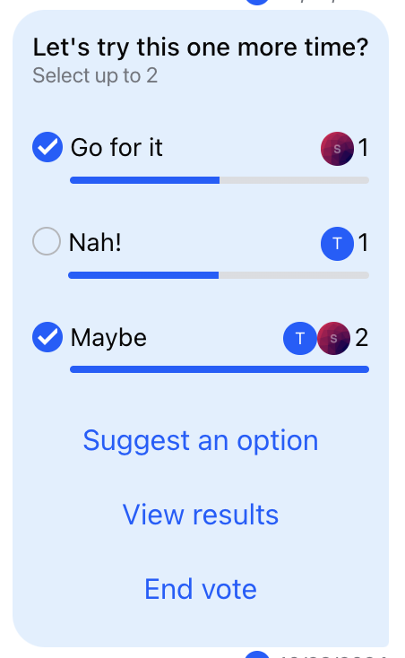
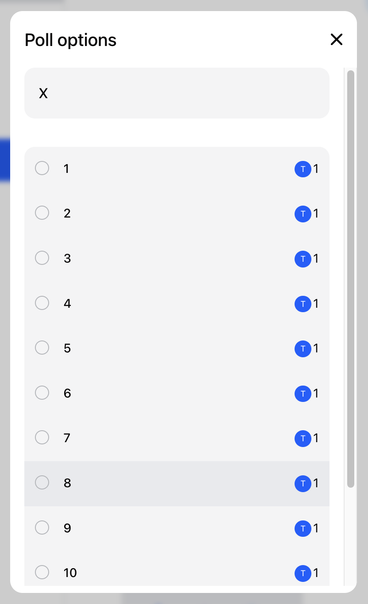
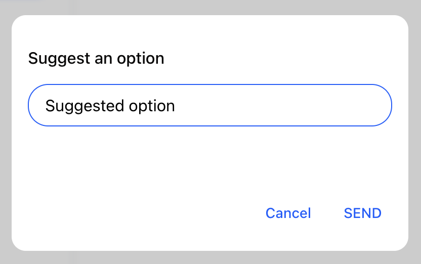
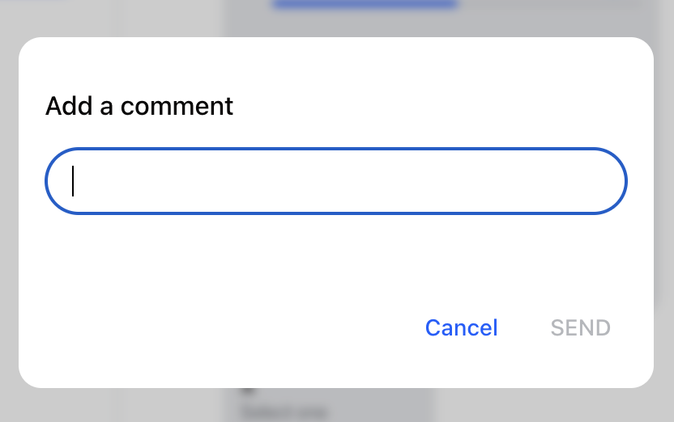
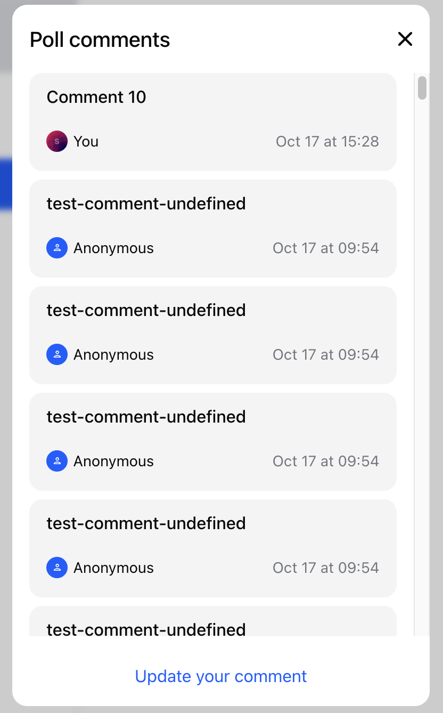
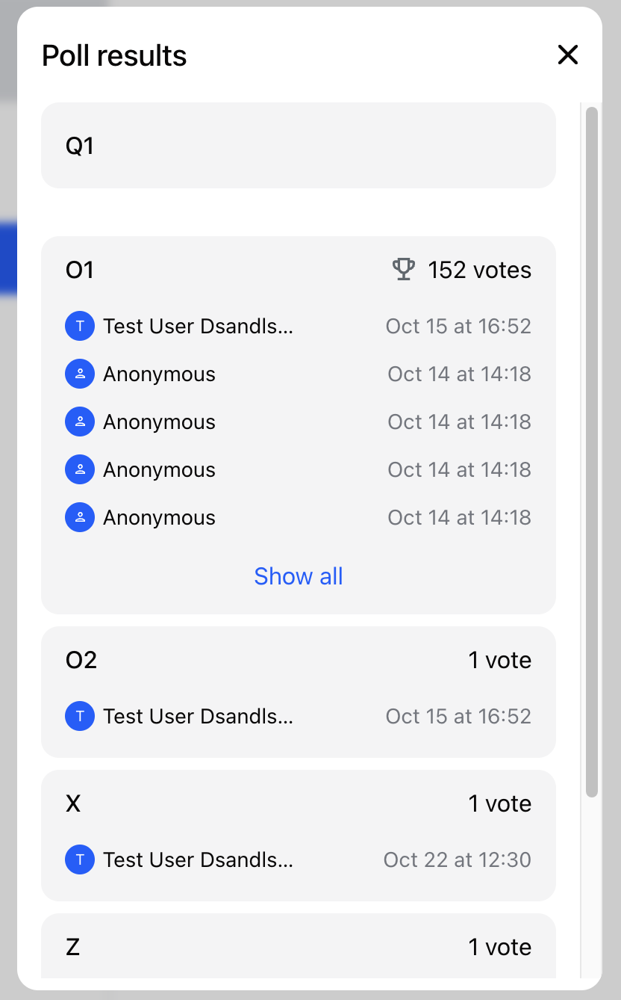
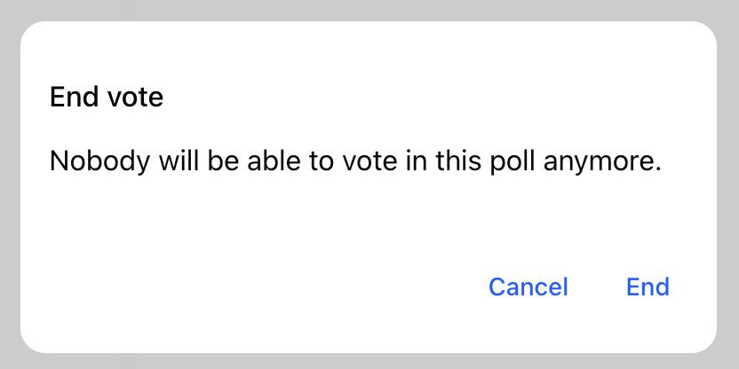

Messages can contain polls. Polls are by default created using `PollCreationDialog` that is invoked from [`AttachmentSelector`](../../message-input-components/attachment-selector). Messages that render polls are not editable. Polls can be only closed by the poll creator. The top-level component to render the message poll data is `Poll` and it renders a header followed by option list and poll actions section.



## Poll UI customization

The following part of the poll UI can be customized:

- `QuotedPoll` - UI rendered if the poll is rendered in a quoted message
- `PollContent` - component that renders the whole non-quoted poll UI
- `PollHeader` - customizes the topmost part of the poll UI
- `PollOptionSelector` - customizes the individual clickable option selectors
- `PollActions` - customizes the bottom part of the poll UI that consists of buttons that invoke action dialogs

### Poll header customization

```tsx
import { ReactNode } from 'react';
import { Channel } from 'stream-chat-react';

const PollHeader = () => <div>Custom Header</div>;

const ChannelWrapper = ({ children }: { children: ReactNode }) => (
  <Channel PollHeader={PollHeader}>{children}</Channel>
);
```

### Poll option selector customization

If we wanted to customize only the option selector we can do it with custom `PollOptionSelector` component.

```tsx
import { ReactNode } from 'react';
import { Channel } from 'stream-chat-react';

const PollOptionSelector = () => <div>Custom Option Selector</div>;

const ChannelWrapper = ({ children }: { children: ReactNode }) => (
  <Channel PollOptionSelector={PollOptionSelector}>{children}</Channel>
);
```

### Poll actions customization

The component `PollActions` controls the display of dialogs or modals that allow user to further interact with the poll data. There are the following poll actions supported by the component that invoke corresponding dialogs resp. modals:

| Action button             | Visible condition                                                                         | Invokes                 |
| ------------------------- | ----------------------------------------------------------------------------------------- | ----------------------- |
| See all options           | option count > 10                                                                         | `PollOptionsFullList`   |
| Suggest an option         | poll is not closed and `poll.allow_user_suggested_options === true`                       | `SuggestPollOptionForm` |
| Add or update own comment | poll is not closed and `poll.allow_answers === true`                                      | `AddCommentForm`        |
| View comments             | `channel.own_capabilities` array contains `'query-poll-votes'` & `poll.answers_count > 0` | `PollAnswerList`        |
| View results              | always visible                                                                            | `PollResults`           |
| End vote                  | owner of the poll                                                                         | `EndPollDialog`         |

**Default PollOptionsFullList**



**Default SuggestPollOptionForm**



**Default AddCommentForm**



**Default PollAnswerList**



**Default PollResults**



**Default EndPollDialog**



Individual dialogs and thus the whole `PollActions` component can be overridden via `PollActions` component props as follows:

```tsx
import { ReactNode } from 'react';
import { Channel, PollActions } from 'stream-chat-react';
import {
  CustomAddCommentForm,
  CustomEndPollDialog,
  CustomPollAnswerList,
  CustomPollOptionsFullList,
  CustomPollResults,
  CustomSuggestPollOptionForm,
} from './PollActions';

const CustomPollActions = () => (
  <PollActions
    AddCommentForm={CustomAddCommentForm}
    EndPollDialog={CustomEndPollDialog}
    PollAnswerList={CustomPollAnswerList}
    PollOptionsFullList={CustomPollOptionsFullList}
    PollResults={CustomPollResults}
    SuggestPollOptionForm={CustomSuggestPollOptionForm}
  />
);

const ChannelWrapper = ({ children }: { children: ReactNode }) => (
  <Channel PollActions={CustomPollActions}>{children}</Channel>
);
```

### Poll contents layout customization

This approach is useful when we want to change the organization of the poll UI. For the purpose we can provide custom `PollContent` component to `Channel`.

```tsx
import { ReactNode } from 'react';
import { Channel } from 'stream-chat-react';
import { CustomPollHeader, CustomPollOptionList } from './Poll';

const PollContents = () => (
  <div>
    <CustomPollHeader />
    <CustomPollOptionList />
  </div>
);

const ChannelWrapper = ({ children }: { children: ReactNode }) => (
  <Channel PollContents={PollContents}>{children}</Channel>
);
```

## Poll API and state

In order to be fully capable to customize the poll UI, we need to learn how to utilize Poll API and later access the reactive poll state.

First of all, the Poll API is exposed via a `Poll` instance. This instance is provided via React context to all the children of the `Poll` component that is rendered internally by `Message` component. The context can be consumed using `usePollContext` hook:

```tsx
import { usePollContext } from 'stream-chat-react';

const Component = () => {
  const { poll } = usePollContext();
};
```

The `Poll` instance exposes the following methods:

- `query` - queries the data for a given poll (permission to query polls is required)
- `update` - overwrites the poll data
- `partialUpdate` - overwrites only the given poll data
- `close` - marks the poll as closed (useful for custom `EndPollDialog`)
- `delete` - deletes the poll
- `createOption` - creates a new option for given poll (useful for custom `SuggestPollOptionForm`)
- `updateOption` - updates an option
- `deleteOption` - removes the option from a poll
- `castVote` - casts a vote to a given option (useful for custom `PollOptionSelector`)
- `removeVote` - removes a vote from a given option (useful for custom `PollOptionSelector`)
- `addAnswer` - adds an answer (comment)
- `removeAnswer` - removes an answer (comment)
- `queryAnswers` - queries and paginates answers (useful for custom `PollAnswerList`)
- `queryOptionVotes` - queries and paginates votes for a given option (useful for option detail)

The poll state can be accessed inside the custom React components using the following pattern

```tsx
import { usePollContext, useStateStore } from 'stream-chat-react';

import type { PollState, PollVote } from 'stream-chat';
import type { StreamChatGenerics } from './types';

type PollStateSelectorReturnValue = {
  latest_votes_by_option: Record<string, PollVote<StreamChatGenerics>[]>;
};

// 1. Define the selector function that receives the fresh value every time the observed property changes
const pollStateSelector = (
  nextValue: PollState<StreamChatGenerics>,
): PollStateSelectorReturnValue => ({ latest_votes_by_option: nextValue.latest_votes_by_option });

const CustomComponent = () => {
  // 2. Retrieve the poll instance from the context
  const { poll } = usePollContext<StreamChatGenerics>();
  // 3. Use the useStateStore hook to subscribe to updates in the poll state with selector picking out only properties we are interested in
  const { latest_votes_by_option } = useStateStore(poll.state, pollStateSelector);
};
```

:::warning
Do not try to access the `poll` data via `message` object available from `MessageContext`. This data is not updated and serve only as a seed, for the `poll` state.
:::

## PollContext

The context is available to all the children of the `Poll` component. Currently it exposes the following properies:

### poll

The instance of a `Poll` class provided by the low-level client. The instance is retrieved from `PollManager` via `client.polls.fromState(pollId)`

```jsx
import { Poll, useChatContext, useMessageContext } from 'stream-chat-react';

const Component = () => {
  const { client } = useChatContext();
  const { message } = useMessageContext();
  const poll = message.poll_id && client.polls.fromState(message.poll_id);

  if (!poll) return null;
  return <Poll poll={poll} />;
};
```

This extraction is done internally by the `MessageSimple` component.
