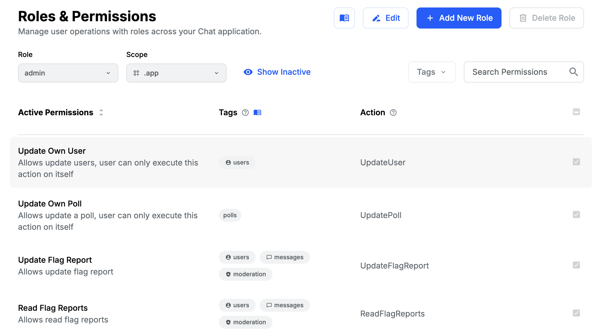
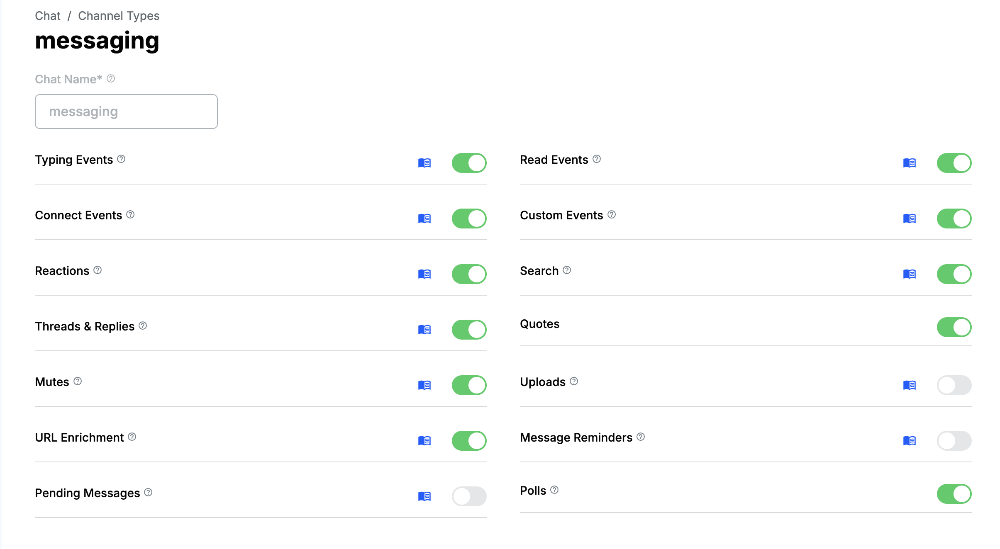

Messages can be enriched with attachments or polls by default. The `AttachmentSelector` component is a component that allows to select what information is to be attached to a message. The attachment objects are included in `message.attachments` property and represent various file uploads. The poll representation is available via `message.poll` property.

## Enabling the default attachment selector features

The configuration is possible via Stream dashboard. File uploads and poll creation can be controlled via

1. role permissions



2. channel type configuration



## File uploads

Uploads are possible only if both Upload Attachment permission is granted to the user role and channel type Uploads configuration is enabled.

## Poll creation

:::note
Polls feature is available in the React SDK as of version 12.5.0
:::

Poll creation is enabled only if both Create Poll permission is granted to the user role and channel type Polls configuration is enabled. Poll creation is not possible withing threads.

### Poll creation UI

The component in charge of rendering [the poll creation UI is `PollCreationDialog`](https://github.com/GetStream/stream-chat-react/blob/master/src/components/Poll/PollCreationDialog/PollCreationDialog.tsx). The component is rendered in a modal and therefore accepts a prop `close`.


Custom `PollCreationDialog` can be provided via `Channel` prop `PollCreationDialog`:

```tsx
import { ReactNode } from 'react';
import { Channel } from 'stream-chat-react';
import type { PollCreationDialogProps } from 'stream-chat-react';

const CustomPollCreationDialog = ({ close }: PollCreationDialogProps) => (
  <div onClick={close}>Custom Poll Creation Dialog</div>
);

const ChannelWrapper = ({ children }: { children: ReactNode }) => (
  <Channel PollCreationDialog={CustomPollCreationDialog}>{children}</Channel>
);
```

Created poll is then rendered within a message list by [`Poll` component](../../message-components/poll).

## Attachment selector customization

### Custom attachment selector actions

Items in the `AttachementSelector` menu can be customized via its `attachmentSelectorActionSet` prop:

```tsx
import { ReactNode } from 'react';
import { AttachmentSelector, Channel, defaultAttachmentSelectorActionSet } from 'stream-chat-react';
import type {
  AttachmentSelectorAction,
  AttachmentSelectorActionProps,
  AttachmentSelectorModalContentProps,
} from 'stream-chat-react';

// Define the menu button
const AddLocationAttachmentAction = ({
  closeMenu,
  openModalForAction,
}: AttachmentSelectorActionProps) => (
  <button
    onClick={() => {
      openModalForAction('addLocation');
      closeMenu();
    }}
  >
    Location
  </button>
);

// Define the modal contents to be rendered if AddLocationAttachmentAction button is clicked
const AddLocationModalContent = ({ close }: AttachmentSelectorModalContentProps) => {
  return <div onClick={close}>abc</div>;
};

// the custom action will be at the top of the menu
const attachmentSelectorActionSet: AttachmentSelectorAction[] = [
  {
    ActionButton: AddLocationAttachmentAction,
    ModalContent: AddLocationModalContent,
    type: 'addLocation',
  },
  ...defaultAttachmentSelectorActionSet,
];

const CustomAttachmentSelector = () => (
  <AttachmentSelector attachmentSelectorActionSet={attachmentSelectorActionSet} />
);

const ChannelWrapper = ({ children }: { children: ReactNode }) => (
  <Channel AttachmentSelector={CustomAttachmentSelector}>{children}</Channel>
);
```

### Custom modal portal destination

By default, the modals invoked by clicking on AttachmentSelector menu buttons are anchored to the channel container `div` element. The destination element can be changed by providing `getModalPortalDestination` prop to `AttachmentSelector`. This would be function that would return a reference to the target element that would serve as a parent for the modal.

```tsx
const getModalPortalDestination = () => document.querySelector<HTMLDivElement>('#my-element-id');

const CustomAttachmentSelector = () => (
  <AttachmentSelector getModalPortalDestination={getModalPortalDestination} />
);
```

## AttachmentSelector context

Components rendered as children of `AttachmentSelector` can access `AttachmentSelectorContext`. The context exposes the following properties:

### fileInput

Reference to `input` element of type `file` used to select files to upload. The reference is `null` if the user does not have a permission to upload files.

| Type               | Default |
| ------------------ | ------- |
| `HTMLInputElement` | `null`  |
