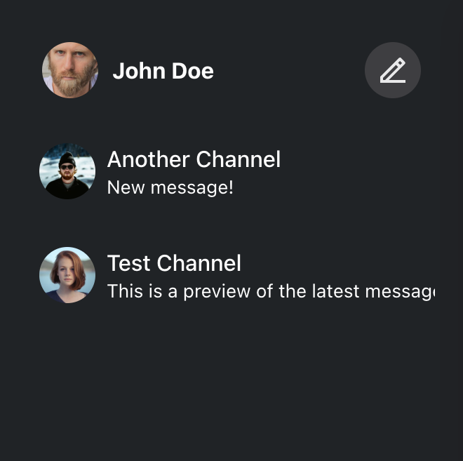
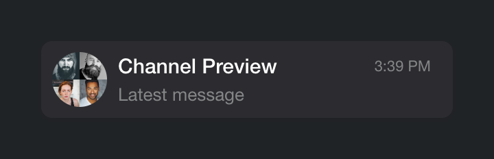
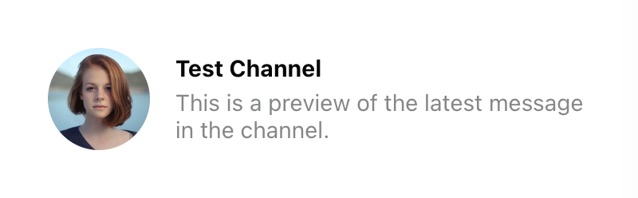
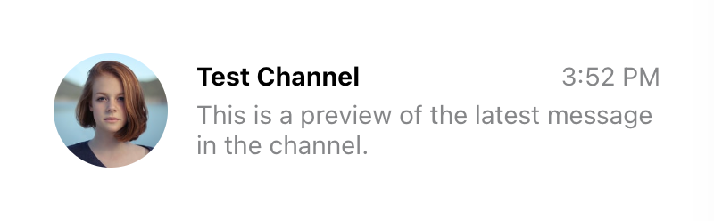
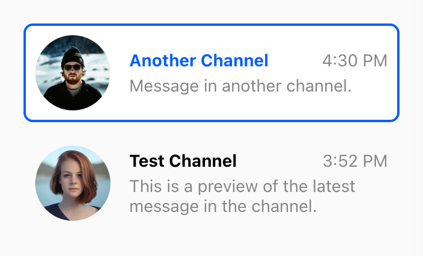
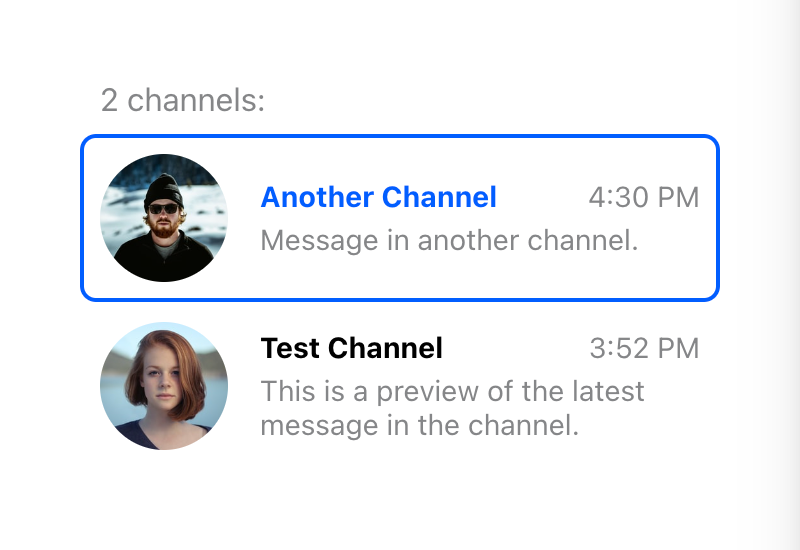
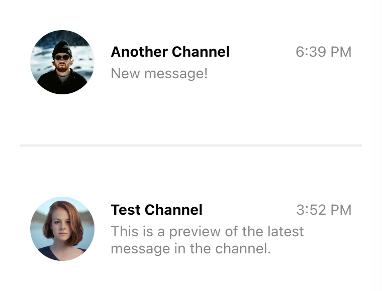

import Tabs from '@theme/Tabs';
import TabItem from '@theme/TabItem';
import ImageShowcase from '@site/src/components/ImageShowcase';



[`ChannelList`](../../components/core-components/channel-list.mdx) is a primary navigation component of a chat, used to display and
switch between available channels. Due to the dynamic, real-time nature of chat,
the [`ChannelList`](../../components/core-components/channel-list.mdx) component needs to subscribe to and handle many different
types of events to keep the list state up to date. This includes handling new
message events and updates to the existing ones, channel update events, channel
member presence events, and so on.

That's a lot of work, and if done incorrectly, it's easy to miss an important
event. That is why we always recommend building on top of the [`ChannelList`](../../components/core-components/channel-list.mdx)
component provided by the SDK, even if you need to do some major customization.
Fortunately, the component itself is very flexible, and basically everything
about it can be customized. It supports

1. [Custom channel preview](#custom-channel-preview)
2. [Custom channel list wrapper](#custom-channel-list-wrapper)
3. [Custom channel list renderer](#custom-channel-list-renderer)
4. [Custom paginator](../channel-list-infinite-scroll.mdx)

This guide takes a deep dive into these customization options.

## Custom Channel Preview

You can think of a channel preview as a single item of the channel list. The
preview should accurately display the current channel state and handle user
interactions to switch to the selected channel.



You can customize the look and behavior of the channel previews by providing a
custom component in the [`Preview`](../../components/core-components/channel-list.mdx#preview) prop of the `ChannelList` component. When
rendering previews, `ChannelList` wraps each item with a `ChannelPreview`
wrapper that handles channel events such as new, updated and deleted messages.
This way, you don't have to subscribe to these events yourself, and you can just
grab the latest state from the props instead.

```jsx
<ChannelList Preview={CustomChannelPreview} />
// Don't forget to provide filter and sort options as well!
```

Let's implement a simple custom preview:

<Tabs groupId="example">
<TabItem value="js" label="React">

```jsx
const CustomChannelPreview = ({ displayImage, displayTitle, latestMessagePreview }) => (
  <div className='channel-preview'>
    
    <div className='channel-preview__main'>
      <div className='channel-preview__header'>{displayTitle}</div>
      <div className='channel-preview__message'>{latestMessagePreview}</div>
    </div>
  </div>
);
```

</TabItem>
<TabItem value="css" label="CSS">

```css
.channel-preview {
  display: flex;
  gap: 16px;
  align-items: center;
  font-size: 0.9em;
  line-height: 1.2em;
}

.channel-preview__avatar {
  width: 64px;
  height: 64px;
  border-radius: 50%;
  object-fit: cover;
}

.channel-preview__main {
  flex-grow: 1;
}

.channel-preview__header {
  font-weight: bold;
  margin-bottom: 4px;
}

.channel-preview__message {
  max-height: 2.4em;
  overflow: hidden;
  color: #858688;
}

.channel-preview__message p {
  margin: 0;
}
```

</TabItem>
</Tabs>

(See also the complete reference of [the available preview component props](../../components/utility-components/channel-preview-ui.mdx).)



The props provided to the preview component are usually sufficient to render the
preview. However, if you need additional data, you can always get it from the
channel state. In this next example, we will add the timestamp of the latest
message in the channel:

<Tabs groupId="example">
<TabItem value="js" label="React">

```jsx
const CustomChannelPreview = (props) => {
  const { channel, displayImage, displayTitle, latestMessagePreview } = props;
  const { userLanguage } = useTranslationContext();
  const latestMessageAt = channel.state.last_message_at;

  const timestamp = useMemo(() => {
    if (!latestMessageAt) {
      return '';
    }
    const formatter = new Intl.DateTimeFormat(userLanguage, {
      timeStyle: 'short',
    });
    return formatter.format(latestMessageAt);
  }, [latestMessageAt, userLanguage]);

  return (
    <div className='channel-preview'>
      
      <div className='channel-preview__main'>
        <div className='channel-preview__header'>
          {displayTitle}
          <time dateTime={latestMessageAt?.toISOString()} className='channel-preview__timestamp'>
            {timestamp}
          </time>
        </div>
        <div className='channel-preview__message'>{latestMessagePreview}</div>
      </div>
    </div>
  );
};
```

</TabItem>
<TabItem value="css" label="CSS">

```css
.channel-preview {
  display: flex;
  gap: 16px;
  align-items: center;
  font-size: 0.9em;
  line-height: 1.2em;
}

.channel-preview__avatar {
  width: 64px;
  height: 64px;
  border-radius: 50%;
  object-fit: cover;
}

.channel-preview__main {
  flex-grow: 1;
}

.channel-preview__header {
  display: flex;
  justify-content: space-between;
  font-weight: bold;
  margin-bottom: 4px;
}

.channel-preview__timestamp {
  font-weight: normal;
  color: #858688;
}

.channel-preview__message {
  max-height: 2.4em;
  overflow: hidden;
  color: #858688;
}

.channel-preview__message p {
  margin: 0;
}
```

</TabItem>
</Tabs>



One more thing we should add is the click event handler, which should change the
currently active channel. That's easy enough to do:

<Tabs groupId="example">
<TabItem value="js" label="React">

```jsx
const CustomChannelPreview = (props) => {
  const {
    channel,
    activeChannel,
    displayImage,
    displayTitle,
    latestMessagePreview,
    setActiveChannel,
  } = props;
  const latestMessageAt = channel.state.last_message_at;
  const isSelected = channel.id === activeChannel?.id;
  const { userLanguage } = useTranslationContext();

  const timestamp = useMemo(() => {
    if (!latestMessageAt) {
      return '';
    }
    const formatter = new Intl.DateTimeFormat(userLanguage, {
      timeStyle: 'short',
    });
    return formatter.format(latestMessageAt);
  }, [latestMessageAt, userLanguage]);

  const handleClick = () => {
    setActiveChannel?.(channel);
  };

  return (
    <button
      className={`channel-preview ${isSelected ? 'channel-preview_selected' : ''}`}
      disabled={isSelected}
      onClick={handleClick}
    >
      
      <div className='channel-preview__main'>
        <div className='channel-preview__header'>
          {displayTitle}
          <time dateTime={latestMessageAt?.toISOString()} className='channel-preview__timestamp'>
            {timestamp}
          </time>
        </div>
        <div className='channel-preview__message'>{latestMessagePreview}</div>
      </div>
    </button>
  );
};
```

</TabItem>
<TabItem value="css" label="CSS">

```css
.channel-preview {
  font: inherit;
  border: 2px solid transparent;
  border-radius: 8px;
  background: none;
  text-align: left;
  padding: 8px;
  display: flex;
  gap: 16px;
  align-items: center;
  font-size: 0.9em;
  line-height: 1.2em;
  cursor: pointer;
}

.channel-preview_selected {
  background: #fff;
  border-color: #005fff;
  cursor: auto;
}

.channel-preview__avatar {
  width: 64px;
  height: 64px;
  border-radius: 50%;
  object-fit: cover;
}

.channel-preview__main {
  flex-grow: 1;
}

.channel-preview__header {
  display: flex;
  justify-content: space-between;
  font-weight: bold;
  margin-bottom: 4px;
}

.channel-preview_selected .channel-preview__header {
  color: #005fff;
}

.channel-preview__timestamp {
  font-weight: normal;
  color: #858688;
}

.channel-preview__message {
  max-height: 2.4em;
  overflow: hidden;
  color: #858688;
}

.channel-preview__message p {
  margin: 0;
}
```

</TabItem>
</Tabs>



Note that we've also added an additional class to the preview element if its
channel is currently active (we check this by comparing the id of the active
channel to the id of the current channel.)

## Custom Channel List Wrapper

Channel list wrapper is responsible for rendering the actual items of the
channel list, as well as handling the loading and error states. This is a great
place to plug in your custom component if you want to have a custom loader, or
to add some additional content (like header and footer) to the channel list.

You can do this by providing a custom custom component in the [`List`](../../components/core-components/channel-list.mdx#list) prop of the
`ChannelList` component. It will get a bunch of props from the parent
`ChannelList`, including a list of loaded channels, a loading flag, and an error
object (if any).

```jsx
<ChannelList List={CustomChannelList} />
// Don't forget to provide filter and sort options as well!
```

The simplest implementation of the custom channel list wrapper looks like this:

<Tabs groupId="example">
<TabItem value="js" label="React">

```jsx
const CustomChannelList = ({ children, loading, error }) => {
  if (loading) {
    return <div className='channel-list__placeholder'>⏳ Loading...</div>;
  }

  if (error) {
    return (
      <div className='channel-list__placeholder'>
        💣 Error loading channels
        <br />
        <button className='channel-list__button' onClick={() => window.location.reload()}>
          Reload page
        </button>
      </div>
    );
  }

  return (
    <div className='channel-list'>
      {loadedChannels && (
        <div className='channel-list__counter'>{loadedChannels.length} channels:</div>
      )}
      {children}
    </div>
  );
};
```

</TabItem>
<TabItem value="css" label="CSS">

```css
.channel-list__placeholder {
  padding: 120px 20px;
  text-align: center;
}

.channel-list__button {
  border: 1px solid #00000014;
  outline: 0;
  background: #fafafa;
  font: inherit;
  border-radius: 4px;
  margin: 8px;
  padding: 8px;
  cursor: pointer;
}

.channel-list__button:focus {
  border-color: #005fff;
}
```

</TabItem>
</Tabs>

import ChannelListLoadingStateImage from '../../assets/channel-list-loading.png';
import ChannelListErrorStateImage from '../../assets/channel-list-error.png';
import ChannelListNormalStateImage from '../../assets/channel-list-preview-selected.png';

<ImageShowcase
  border
  items={[
    {
      image: ChannelListLoadingStateImage,
      caption: <span>Loading state</span>,
      alt: '',
    },
    {
      image: ChannelListErrorStateImage,
      caption: <span>Error state</span>,
      alt: '',
    },
    {
      image: ChannelListNormalStateImage,
      caption: <span>Normal state</span>,
      alt: '',
    },
  ]}
/>

If you need access to the array of channel objects, you can use the
`loadedChannels` prop. Keep in mind, however, that it can update frequently,
resulting in excessive rendering. For this reason, you have to explicitly opt-in
by setting the [`sendChannelsToList`](../../components/core-components/channel-list.mdx#sendchannelstolist) prop on the `ChannelList`:

<Tabs groupId="example">
<TabItem value="js" label="React">

```jsx
<ChannelList List={CustomChannelList} sendChannelsToList />;
// Don't forget to provide filter and sort options as well!

const CustomChannelList = ({
  loadedChannels,
  children,
  loading,
  error,
}: React.PropsWithChildren<ChannelListMessengerProps<StreamChatGenerics>>) => {
  if (loading) {
    return <div className='channel-list__placeholder'>⏳ Loading...</div>;
  }

  if (error) {
    return (
      <div className='channel-list__placeholder'>
        💣 Error loading channels
        <br />
        <button className='channel-list__button' onClick={() => window.location.reload()}>
          Reload page
        </button>
      </div>
    );
  }

  if (loadedChannels?.length === 0) {
    return <div className='channel-list__placeholder'>🤷 You have no channels... yet</div>;
  }

  return (
    <div className='channel-list'>
      {loadedChannels && (
        <div className='channel-list__counter'>{loadedChannels.length} channels:</div>
      )}
      {children}
    </div>
  );
};
```

</TabItem>
<TabItem value="css" label="CSS">

```css
.channel-list__placeholder {
  padding: 120px 20px;
  text-align: center;
}

.channel-list__button {
  border: 1px solid #00000014;
  outline: 0;
  background: #fafafa;
  font: inherit;
  border-radius: 4px;
  margin: 8px;
  padding: 8px;
  cursor: pointer;
}

.channel-list__button:focus {
  border-color: #005fff;
}

.channel-list__counter {
  color: #858688;
  margin: 0 10px 8px;
}
```

</TabItem>
</Tabs>



## Custom Channel List Renderer

By default, the [`ChannelList`](../../components/core-components/channel-list.mdx) component provided by the SDK renders channel
previews in the same order as the channels were queried. If you want to hook
into the list rendering process, e.g. to add subheadings, group channels, etc.,
you can provide a custom list renderer in the [`renderChannels`](../../components/core-components/channel-list.mdx#renderchannels) prop of the
`ChannelList` component.

The function passed in this prop takes a list of loaded channels and a channel
preview component. Note that it is not exactly the component passed in the
[`Preview`](../../components/core-components/channel-list.mdx#preview) prop, but rather a version of that component wrapped with the
`ChannelPreview` helper to ensure that all channel event listeners are set up
properly. The `renderChannels` function is only called if the channel list was
successfully loaded and is not empty.

This example adds a separator between read and unread channels:

<Tabs groupId="example">
<TabItem value="js" label="React">

```jsx
const renderChannels = (channels, getChannelPreview) => {
  const unreadChannels = [];
  const readChannels = [];

  for (const channel of channels) {
    const hasUnread = channel.countUnread();
    (hasUnread ? unreadChannels : readChannels).push(channel);
  }

  return [unreadChannels, readChannels]
    .filter((group) => group.length > 0)
    .map((group, index) => (
      <div key={index} className='channel-group'>
        {group.map((channel) => (
          <div key={channel.id}>{getChannelPreview(channel)}</div>
        ))}
      </div>
    ));
};
```

</TabItem>
<TabItem value="css" label="CSS">

```css
.channel-group + .channel-group {
  padding-top: 40px;
  margin-top: 40px;
  border-top: 2px solid #00000014;
}
```

</TabItem>
</Tabs>


