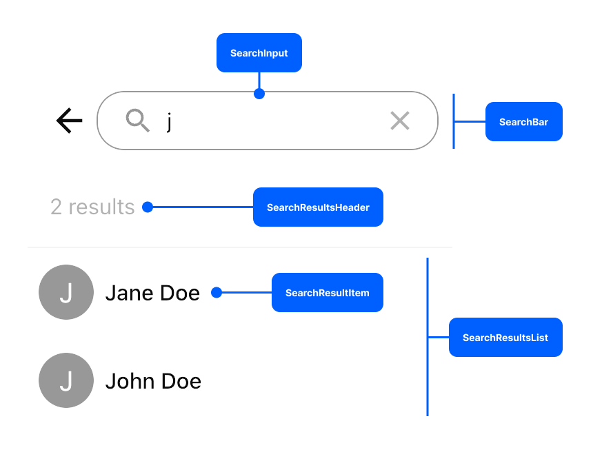
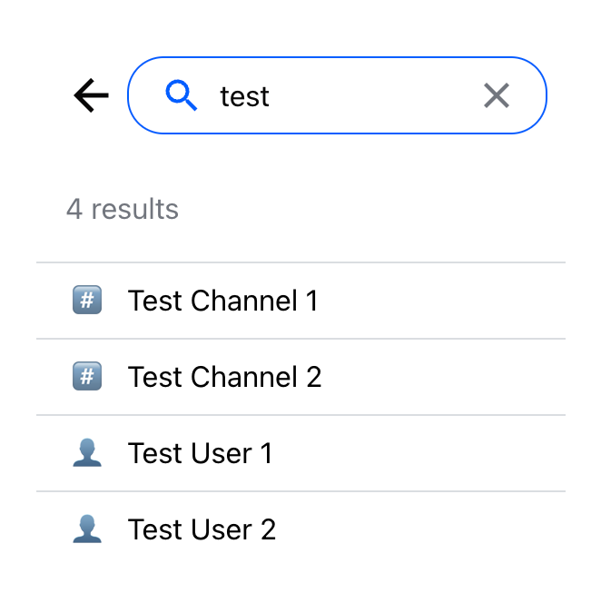
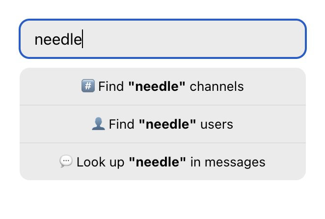
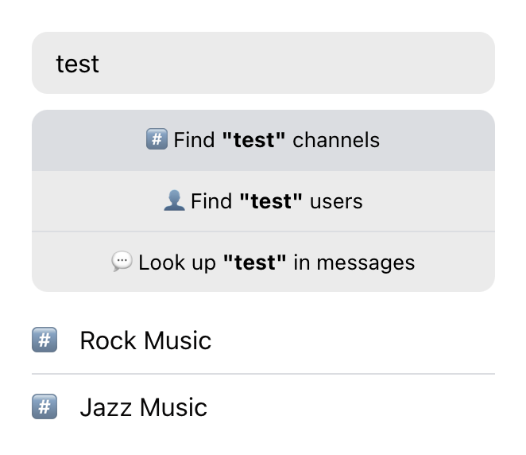
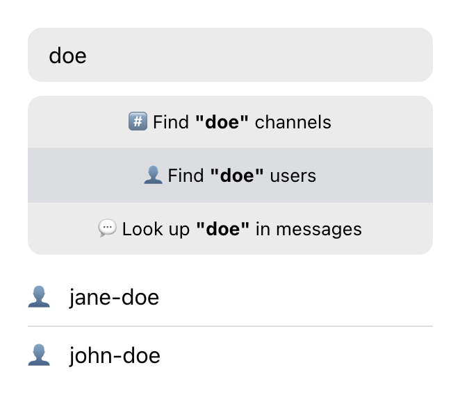
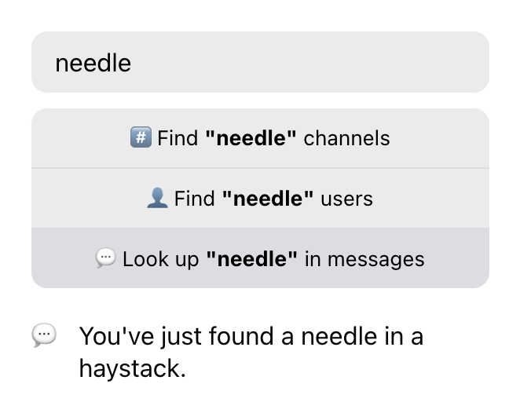

import Tabs from '@theme/Tabs';
import TabItem from '@theme/TabItem';

Channel search is used to find channels based on a query that includes user
input. Depending on your needs, it can be used to either find existing
conversations, start new ones, or do both.

There are two ways to use the built-in search functionality:

1. by enabling search in the `ChannelList` component with the
   [`showChannelSearch`](../../components/core-components/channel-list.mdx#showchannelsearch) prop,
2. or by using the [`ChannelSearch`](../../components/utility-components/channel-search.mdx) component directly.

Whichever works better for you, the [`ChannelSearch`](../../components/utility-components/channel-search.mdx) component is the one that handles the UI logic.

In the first case, if you're using the search functionality of the
`ChannelList` component, the `ChannelSearch` is rendered by the `ChannelList`.
You can still pass props to the underlying `ChannelSearch` through the
[`additionalChannelSearchProps`](../../components/core-components/channel-list.mdx#showchannelsearch#additionalchannelsearchprops).

For example, you could enable search in the `ChannelList` (with the
[`showChannelSearch`](../../components/core-components/channel-list.mdx#showchannelsearch) prop), and configure the search results to include both channels
and users by passing settings in the [`additionalChannelSearchProps`](../../components/core-components/channel-list.mdx#showchannelsearch#additionalchannelsearchprops):

```jsx
<ChannelList
  filters={filters}
  sort={sort}
  options={options}
  showChannelSearch
  additionalChannelSearchProps={{ searchForChannels: true }}
/>
```

In the second case, if you're using the [`ChannelSearch`](../../components/utility-components/channel-search.mdx) component directly,
you can pass settings directly as props of the `ChannelSearch` component:

```jsx
<ChannelSearch searchForChannels />
```

## Component Anatomy

The [`ChannelSearch`](../../components/utility-components/channel-search.mdx) component consists of the search bar (including the search
input), the results header, and the results list (consisting of individual search
results items).



Each of these components can be overridden by passing custom components in the
[`ChannelSearch` props](../../components/utility-components/channel-search.mdx#Props):

```jsx
<ChannelSearch
  SearchBar={CustomSearchBar}
  SearchInput={CustomInput}
  SearchResultsHeader={CustomHeader}
  SearchResultsList={CustomList}
  SearchResultItem={CustomItem}
/>
```

If you're using the search functionality of the `ChannelList` components, you
can pass the same custom components to the [`additionalChannelSearchProps`](../../components/core-components/channel-list.mdx#showchannelsearch#additionalchannelsearchprops):

```jsx
<ChannelList
  filters={filters}
  sort={sort}
  options={options}
  showChannelSearch
  additionalChannelSearchProps={{
    SearchBar: CustomSearchBar,
    SearchInput: CustomInput,
    SearchResultsHeader: CustomHeader,
    SearchResultsList: CustomList,
    SearchResultItem: CustomItem,
  }}
/>
```

Next, we'll take a closer look at some of these customization options. But first, we encourage you to explore the many out-of-the-box [customization options](../../components/utility-components/channel-search.mdx) that do not require you to provide custom components.

<!-- Note: I'm removing this whole section because changing the order of search
results in the `SearchResultList` component breaks keyboard navigation in the
list. At the same time, I can't think of any useful examples that DON'T change
the order of the results, so it's better to just omit the whole thing.

## Overriding the Search Result List

When overriding the search result list, you get direct access to an array
containing search results. This makes it an ideal place to add client-side
sorting or grouping. For example, you might want to group channels and users
separately, then you can do this:

```jsx
function CustomSearchResultsList({ results, SearchResultItem, ...itemProps }) {
  const channels = results.filter((item) => item.cid);
  const users = results.filter((item) => !item.cid);
  let itemIndex = 0;

  return [channels, users]
    .filter((group) => group.length > 0)
    .map((group, groupIndex) => (
      <div key={groupIndex} className="search-results-group">
        {group.map((item) => {
          const children = (
            <div key={item.id} className="search-results-item">
              <SearchResultItem
                result={item}
                index={itemIndex}
                {...itemProps}
              />
            </div>
          );
          itemIndex++;
          return children;
        })}
      </div>
    ));
}
```

```css

```

Note that we're not reimplementing previews for search result items, and just
rending `SearchResultItem` instead. Since the `SearchResultItem` component is
also overridable, it's best to always you the component provided in props.

Keeping track of item indicies as important, since the SDK provides index-based
support for keyboard navigation in search results. So make sure that the
consequitive index prop is set on each `SearchResultItem`.

When overriding `SearchResultsList`, we don't have to worry about loading or
empty states (the component is not rendered at all in those cases). Custom
loader can be added by passing a custom component in the `SearchLoading` prop.
Custom empty state placeholder can be passed in the `SearchEmpty` prop. -->

## Overriding the Search Result Item

You can override the way each search result item is presented by providing a
custom `SearchResultItem`.

```jsx
<ChannelSearch SearchResultItem={CustomSearchResultItem} />
```

Or:

```jsx
<ChannelList
  additionalChannelSearchProps={{
    SearchResultItem: CustomSearchResultItem,
  }}
/>
// Don't forget to provide filter and sort options as well!
```

This component receives a search result item as a prop, which can be either a
`UserResponse` or a `Channel` (if the [`searchForChannels`](../../components/utility-components/channel-search.mdx#searchforchannels) option is enabled).

Your custom implementation should be able to:

1. Display both channel and user search result items.
2. Provide visual feedback for an item focused with the arrow keys. We can do this by
   looking at the `focusUser` prop which contains the index of the currently
   selected item.
3. When clicked, it should invoke the `selectResult` callback.

<Tabs groupId="example">
<TabItem value="js" label="React">

```jsx
const CustomSearchResultItem = ({ result, index, focusedUser, selectResult }) => {
  const isChannel = result.cid;

  return (
    <button
      className={`search-result-item ${index === focusedUser ? 'search-result-item_focused' : ''}`}
      onClick={() => selectResult(result)}
    >
      {isChannel ? (
        <>
          <span className='search-result-item__icon'>#️⃣</span>
          {result.data?.name}
        </>
      ) : (
        <>
          <span className='search-result-item__icon'>👤</span>
          {result.name ?? result.id}
        </>
      )}
    </button>
  );
};
```

</TabItem>
<TabItem value="css" label="CSS">

```css
.search-result-item {
  font: inherit;
  border: 0;
  background: none;
  padding: 10px 20px 10px 50px;
  text-align: left;
}

.search-result-item:not(:last-child) {
  border-bottom: 1px solid #dbdde1;
}

.search-result-item_focused {
  background: #dbdde1;
}

.search-result-item__icon {
  display: inline-block;
  width: 30px;
  margin-left: -30px;
}
```

</TabItem>
</Tabs>



## Implementing Search from Scratch

You don't have to rely on the components provided in the SDK to implement
search. For ultimate customization, it's not too difficult to implement search
from scratch. You'll have to manage the state yourself, and use our low-level client
methods to query for results, but the upside is that you can manipulate the
results however you like.

See our client documentation to learn how to query for [channels](https://getstream.io/chat/docs/react/query_channels/?language=javascript),
[users](https://getstream.io/chat/docs/react/query_users/?language=javascript), or [messages](https://getstream.io/chat/docs/react/search/?language=javascript). As a quick reference, here are the queries we will
be using:

```js
// Query at most 5 messaging channels where current user is a member,
// by channel name:
const channels = await client.queryChannels(
  {
    type: 'messaging',
    name: { $autocomplete: query },
    members: { $in: [userId] },
  },
  { last_message_at: -1, updated_at: -1 },
  { limit: 5 },
);
```

```js
// Query at most 5 users (except the current one), by user name or id:
const { users } = await client.queryUsers(
  {
    $or: [{ id: { $autocomplete: query } }, { name: { $autocomplete: query } }],
    id: { $ne: userId },
  },
  { id: 1, name: 1 },
  { limit: 5 },
);
```

```js
// Query at most 5 messages from the messaging channels where current user
// is a member, by message text:
const { results } = await client.search({ type: 'messaging', members: { $in: [userId] } }, query, {
  limit: 5,
});
const messages = results.map((item) => item.message);
```

Next, let's add some simple text input and some buttons to search for channels,
users, or messages:

<Tabs groupId="example">
<TabItem value="js" label="React">

```jsx
const CustomSearch = () => {
  const [query, setQuery] = useState('');

  return (
    <div className='search'>
      <input
        type='search'
        className='search-input'
        value={query}
        onChange={(event) => setQuery(event.target.value)}
      />
      {query && (
        <div className='search-actions'>
          <button type='button' className='search-button'>
            #️⃣ Find "{query}" channels
          </button>
          <button type='button' className='search-button'>
            👤 Find "{query}" users
          </button>
          <button type='button' className='search-button'>
            💬 Look up "{query}" in messages
          </button>
        </div>
      )}
    </div>
  );
};
```

</TabItem>
<TabItem value="css" label="CSS">

```css
.search-input {
  width: 100%;
  border: 0;
  border-radius: 10px;
  background: #00000014;
  font: inherit;
  padding: 10px 15px;
}

.search-input::-webkit-search-cancel-button {
  appearance: none;
}

.search-actions {
  display: flex;
  flex-direction: column;
  margin: 10px 0 20px;
}

.search-button {
  background: #00000014;
  border: 0;
  border-bottom: 1px solid #dbdde1;
  padding: 10px 15px;
  cursor: pointer;
}

.search-button:first-child {
  border-radius: 10px 10px 0 0;
}

.search-button:last-child {
  border-radius: 0 0 10px 10px;
  border-bottom: 0;
}

.search-button:hover {
  background: #dbdde1;
}
```

</TabItem>
</Tabs>



So far, our `CustomSearch` component doesn't do anything. Let's wire things up
by adding click event listeners to the search buttons.

<details>
<summary><strong>A note about race conditions</strong></summary>

One thing we should be aware of is race conditions: we should either abort
or discard the results of the previous request when making a new one, or prevent a
user from making multiple requests at once. Better yet, use a query
library like [TanStack Query](https://tanstack.com/query/latest) or
[SWR](https://swr.vercel.app/) to make requests.

In this example, we will use a helper function that will protect us
from race conditions:

```js
function useSearchQuery() {
  const [results, setResults] = useState(null);
  const [pending, setPending] = useState(false);
  const pendingRequestAbortController = useRef(null);

  const startNextRequestWithSignal = () => {
    pendingRequestAbortController.current?.abort();
    pendingRequestAbortController.current = new AbortController();
    return pendingRequestAbortController.current.signal;
  };

  const querySearchResults = async (fether) => {
    setPending(true);
    const signal = startNextRequestWithSignal();
    const results = await fether();

    if (!signal.aborted) {
      setResults(results);
      setPending(false);
    }
  };

  return { results, pending, querySearchResults };
}
```

</details>

:::caution

If you're implementing the "search as you type" user experience,
don't forget to debounce or throttle your search requests. Otherwise, you can quickly
hit rate limits.

:::

```jsx
import { useChatContext } from 'stream-chat-react';

const CustomSearch = () => {
  const { client } = useChatContext();
  const [query, setQuery] = useState('');
  const { results, pending, querySearchResults } = useSearchQuery();

  const handleChannelSearchClick = () => {
    querySearchResults(async () => {
      const channels = await client.queryChannels(
        {
          type: 'messaging',
          name: { $autocomplete: query },
          members: { $in: [userId] },
        },
        { last_message_at: -1, updated_at: -1 },
        { limit: 5 },
      );

      return {
        entity: 'channel',
        items: channels,
      };
    });
  };

  const handleUserSearchClick = () => {
    querySearchResults(async () => {
      const { users } = await client.queryUsers(
        {
          $or: [{ id: { $autocomplete: query } }, { name: { $autocomplete: query } }],
          id: { $ne: userId },
        },
        { id: 1, name: 1 },
        { limit: 5 },
      );

      return {
        entity: 'user',
        items: users,
      };
    });
  };

  const handleMessageSearchClick = () => {
    querySearchResults(async () => {
      const { results } = await client.search(
        { type: 'messaging', members: { $in: [userId] } },
        query,
        { limit: 5 },
      );

      return {
        entity: 'message',
        items: results.map((item) => item.message),
      };
    });
  };

  return (
    <div className='search'>
      <input
        type='search'
        className='search-input'
        value={query}
        onChange={(event) => setQuery(event.target.value)}
      />
      {query && (
        <div className='search-actions'>
          <button type='button' className='search-button' onClick={handleChannelSearchClick}>
            #️⃣ Find <strong>"{query}"</strong> channels
          </button>
          <button type='button' className='search-button' onClick={handleUserSearchClick}>
            👤 Find <strong>"{query}"</strong> users
          </button>
          <button type='button' className='search-button' onClick={handleMessageSearchClick}>
            💬 Look up <strong>"{query}"</strong> in messages
          </button>
        </div>
      )}
    </div>
  );
};
```

Finally, we need to display the search results to the user. You can use components
like `ChannelPreview` that come with the SDK, or you can create your own. Let's
create very simple preview components for channels, users, and messages:

<Tabs groupId="example">
<TabItem value="js" label="React">

```jsx
const ChannelSearchResultPreview = ({ channel }) => (
  <li className='search-results__item'>
    <div className='search-results__icon'>#️⃣</div>
    {channel.data?.name}
  </li>
);

const UserSearchResultPreview = ({ user }) => (
  <li className='search-results__item'>
    <div className='search-results__icon'>👤</div>
    {user.name ?? user.id}
  </li>
);

const MessageSearchResultPreview = ({ message }) => (
  <li className='search-results__item'>
    <div className='search-results__icon'>💬</div>
    {message.text}
  </li>
);

const SearchResultsPreview = ({ results }) => {
  if (results.items.length === 0) {
    return <div class='search-results'>🤷‍♂️ No results</div>;
  }

  return (
    <ul className='search-results'>
      {results.entity === 'channel' &&
        results.items.map((item) => <ChannelSearchResultPreview key={item.cid} channel={item} />)}
      {results.entity === 'user' &&
        results.items.map((item) => <UserSearchResultPreview key={item.id} user={item} />)}
      {results.entity === 'message' &&
        results.items.map((item) => <MessageSearchResultPreview key={item.id} message={item} />)}
    </ul>
  );
};
```

</TabItem>
<TabItem value="css" label="CSS">

```css
.search-results {
  list-style: none;
  padding: 0;
  margin: 0;
}

.search-results__item {
  padding-left: 30px;
}

.search-results__item:not(:last-child) {
  margin-bottom: 10px;
  padding-bottom: 10px;
  border-bottom: 1px solid #dbdde1;
}

.search-results__icon {
  display: inline-block;
  width: 30px;
  margin-left: -30px;
}
```

</TabItem>
</Tabs>





What happens when you click on a search result depends on your desired user
experience. If you click on a channel, it makes sense to set the channel as
active. When clicking on a user, you may want to create or open a channel with
a one-on-one conversation with the user. When clicking on a message, it's
probably expected that a relevant channel will be set as active and scrolled to the
message.

<Tabs groupId="example">
<TabItem value="channel" label="Channel Preview">

```jsx
import { useChatContext } from 'stream-chat-react';

const ChannelSearchResultPreview = ({ channel }) => {
  const { setActiveChannel } = useChatContext();

  return (
    <li className='search-results__item' onClick={() => setActiveChannel(channel)}>
      <div className='search-results__icon'>#️⃣</div>
      {channel.data?.name}
    </li>
  );
};
```

</TabItem>
<TabItem value="user" label="User Preview">

```jsx
import { useChatContext } from 'stream-chat-react';

const UserSearchResultPreview = ({ user }) => {
  const { client, setActiveChannel } = useChatContext();

  const handleClick = async () => {
    const channel = client.channel('messaging', { members: [userId, user.id] });
    await channel.watch();
    setActiveChannel(channel);
  };

  return (
    <li className='search-results__item' onClick={handleClick}>
      <div className='search-results__icon'>👤</div>
      {user.name ?? user.id}
    </li>
  );
};
```

</TabItem>
<TabItem value="message" label="Message Preview">

```jsx
import { useChatContext } from 'stream-chat-react';

const MessageSearchResultPreview = ({ message }) => {
  const history = useHistory(); // bring your own router of choice
  const { client, setActiveChannel } = useChatContext();

  const handleClick = async () => {
    if (message.channel) {
      const channel = client.channel(message.channel.type, message.channel.id);
      setActiveChannel(channel);
      await channel.state.loadMessageIntoState(message.id);
      history.replace(`${window.location.pathname}#${message.id}`);
    }
  };

  return (
    <li className='search-results__item' onClick={handleClick}>
      <div className='search-results__icon'>💬</div>
      {message.text}
    </li>
  );
};

// Somewhere in your application code:
const location = useLocation();
const messageId = useMemo(() => new URL(location).hash.slice(1), [location]);
<MessageList highlightedMessageId={messageId} />;
```

</TabItem>
</Tabs>

And that's it! Here's the complete code:

<Tabs groupId="example">
<TabItem value="js" label="React">

```jsx
import { useChatContext } from 'stream-chat-react';

const CustomSearch = () => {
  const { client } = useChatContext();
  const [query, setQuery] = useState('');
  const { results, pending, querySearchResults } = useSearchQuery();
  // Use your favorite query library here 👆

  const handleChannelSearchClick = async () => {
    querySearchResults(async () => {
      const channels = await client.queryChannels(
        {
          type: 'messaging',
          name: { $autocomplete: query },
          members: { $in: [userId] },
        },
        { last_message_at: -1, updated_at: -1 },
        { limit: 5 },
      );

      return {
        entity: 'channel',
        items: channels,
      };
    });
  };

  const handleUserSearchClick = async () => {
    querySearchResults(async () => {
      const { users } = await client.queryUsers(
        {
          $or: [{ id: { $autocomplete: query } }, { name: { $autocomplete: query } }],
          id: { $ne: userId },
        },
        { id: 1, name: 1 },
        { limit: 5 },
      );

      return {
        entity: 'user',
        items: users,
      };
    });
  };

  const handleMessageSearchClick = async () => {
    querySearchResults(async () => {
      const { results } = await client.search(
        { type: 'messaging', members: { $in: [userId] } },
        query,
        { limit: 5 },
      );

      return {
        entity: 'message',
        items: results.map((item) => item.message),
      };
    });
  };

  return (
    <div className='search'>
      <input
        type='search'
        className='search-input'
        value={query}
        placeholder='Search'
        onChange={(event) => setQuery(event.target.value)}
      />
      {query && (
        <div className='search-actions'>
          <button type='button' className='search-button' onClick={handleChannelSearchClick}>
            #️⃣ Find <strong>"{query}"</strong> channels
          </button>
          <button type='button' className='search-button' onClick={handleUserSearchClick}>
            👤 Find <strong>"{query}"</strong> users
          </button>
          <button type='button' className='search-button' onClick={handleMessageSearchClick}>
            💬 Look up <strong>"{query}"</strong> in messages
          </button>
        </div>
      )}

      {pending && <>Searching...</>}
      {results && <SearchResultsPreview results={results} />}
    </div>
  );
};

const ChannelSearchResultPreview = ({ channel }) => {
  const { setActiveChannel } = useChatContext();

  return (
    <li className='search-results__item' onClick={() => setActiveChannel(channel)}>
      <div className='search-results__icon'>#️⃣</div>
      {channel.data?.name}
    </li>
  );
};

const UserSearchResultPreview = ({ user }) => {
  const { client, setActiveChannel } = useChatContext();

  const handleClick = async () => {
    const channel = client.channel('messaging', { members: [userId, user.id] });
    await channel.watch();
    setActiveChannel(channel);
  };

  return (
    <li className='search-results__item' onClick={handleClick}>
      <div className='search-results__icon'>👤</div>
      {user.name ?? user.id}
    </li>
  );
};

const MessageSearchResultPreview = ({ message }) => {
  const history = useHistory(); // bring your own router of choice
  const { client, setActiveChannel } = useChatContext();

  const handleClick = async () => {
    if (message.channel) {
      const channel = client.channel(message.channel.type, message.channel.id);
      setActiveChannel(channel);
      await channel.state.loadMessageIntoState(message.id);
      history.replace(`${window.location.pathname}#${message.id}`);
    }
  };

  return (
    <li className='search-results__item' onClick={handleClick}>
      <div className='search-results__icon'>💬</div>
      {message.text}
    </li>
  );
};

const SearchResultsPreview = ({ results }) => {
  if (results.items.length === 0) {
    return <>No results</>;
  }

  return (
    <ul className='search-results'>
      {results.entity === 'channel' &&
        results.items.map((item) => <ChannelSearchResultPreview key={item.cid} channel={item} />)}
      {results.entity === 'user' &&
        results.items.map((item) => <UserSearchResultPreview key={item.id} user={item} />)}
      {results.entity === 'message' &&
        results.items.map((item) => <MessageSearchResultPreview key={item.id} message={item} />)}
    </ul>
  );
};
```

</TabItem>
<TabItem value="css" label="CSS">

```css
.search-input {
  width: 100%;
  border: 0;
  border-radius: 10px;
  background: #00000014;
  font: inherit;
  padding: 10px 15px;
}

.search-input::-webkit-search-cancel-button {
  appearance: none;
}

.search-actions {
  display: flex;
  flex-direction: column;
  margin: 10px 0 20px;
}

.search-button {
  background: #00000014;
  border: 0;
  border-bottom: 1px solid #dbdde1;
  padding: 10px 15px;
  cursor: pointer;
}

.search-button:first-child {
  border-radius: 10px 10px 0 0;
}

.search-button:last-child {
  border-radius: 0 0 10px 10px;
  border-bottom: 0;
}

.search-button:hover {
  background: #dbdde1;
}

.search-results {
  list-style: none;
  padding: 0;
  margin: 0;
}

.search-results__item {
  padding-left: 30px;
}

.search-results__item:not(:last-child) {
  margin-bottom: 10px;
  padding-bottom: 10px;
  border-bottom: 1px solid #dbdde1;
}

.search-results__icon {
  display: inline-block;
  width: 30px;
  margin-left: -30px;
}
```

</TabItem>
</Tabs>
