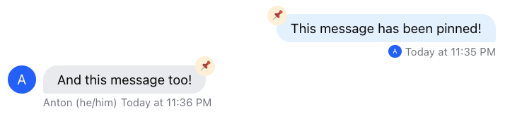
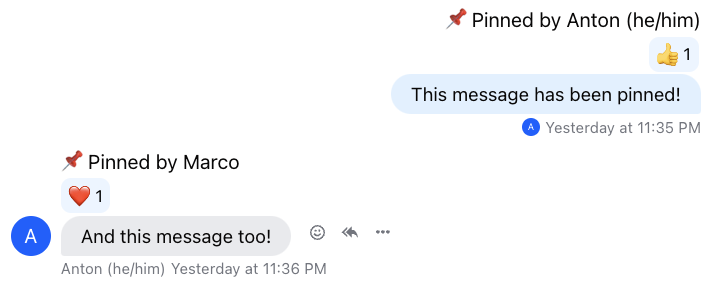

import Tabs from '@theme/Tabs';
import TabItem from '@theme/TabItem';

In this example, we will demonstrate how to create a custom pin indicator for pinned messages. [Pinned messages](https://getstream.io/chat/docs/javascript/pinned_messages/?language=javascript) allow users to highlight important messages, make announcements, or temporarily promote content.

## Custom Pin Indicator

### CSS Based Solution

Let's start with the less invasive and fairly simple CSS based solution. All the class names you need to build this feature are in place and toggled appropriately. We'll add `::before` pseudo-class to our message bubble element with a pin (📌) icon to display whenever message has been pinned.

```css
.str-chat__message--pinned .str-chat__message-bubble::before {
  content: '📌';
  display: flex;
  align-items: center;
  justify-content: center;
  position: absolute;
  background-color: papayawhip;
  font-size: 0.6rem;
  width: 1.4rem;
  height: 1.4rem;
  border-radius: 9999px;
  z-index: 1;
  top: -10px;
}

.str-chat__message--other.str-chat__message--pinned .str-chat__message-bubble::before {
  right: -10px;
}

.str-chat__message--me.str-chat__message--pinned .str-chat__message-bubble::before {
  left: -10px;
}
```



### Component Based Solution

While CSS solution is certainly less invasive it's also less malleable when it comes to hooking some JavaScript to it. For that case the component based solution is also an option. In this example we'll build an indicator which displays the name of the user who pinned the message. We'll pass our custom component to the [`Channel`](../../components/core-components/channel.mdx) prop `PinIndicator` which forwards it to [`ComponentContext`](../../components/contexts/component-context.mdx) from which it'll be picked up by the [`MessageSimple`](../../components/message-components/message-ui.mdx) component to render.

<Tabs groupId="example">
<TabItem value="js" label="React">

```jsx
import { Channel } from 'stream-chat-react';

const CustomPinIndicator = () => {
  const { message } = useMessageContext('CustomPinIndicator');

  const pinnedBy = message.pinned_by?.name || message.pinned_by?.id;

  if (!pinnedBy) return null;

  return <div className='pin-indicator'>📌 Pinned by {pinnedBy}</div>;
};

//...

<Channel PinIndicator={CustomPinIndicator}>...</Channel>;
```

</TabItem>
<TabItem value="css" label="CSS">

```css
.pin-indicator {
  grid-area: pin;
}

.str-chat__message.str-chat__message--other,
.str-chat__message.str-chat__quoted-message-preview {
  grid-template-areas:
    '. pin'
    'avatar message'
    '. replies'
    '. translation-notice'
    '. custom-metadata'
    '. metadata';
}

.str-chat__message.str-chat__message--me {
  grid-template-areas:
    'pin'
    'message'
    'replies'
    'translation-notice'
    'custom-metadata'
    'metadata';
}
```

</TabItem>
</Tabs>



### Read More

See more on permissions regarding message pinning in [_Permissions v2_](https://getstream.io/chat/docs/react/user_permissions/?language=javascript) section of our JS documentation.
