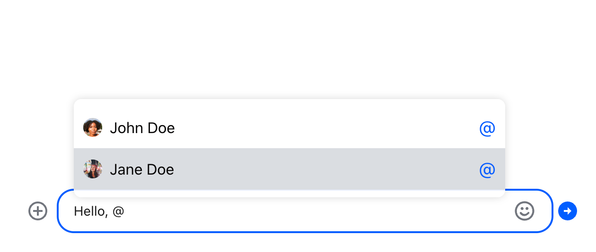
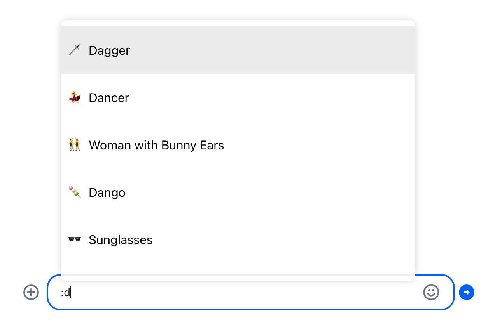
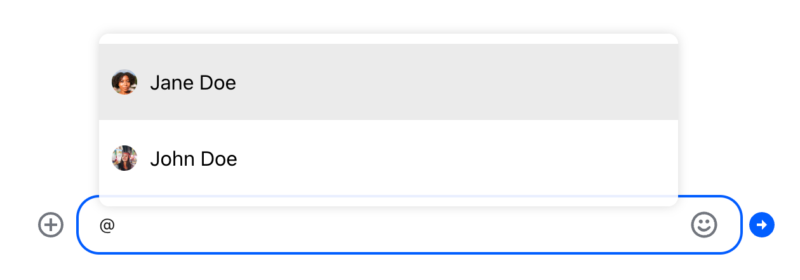
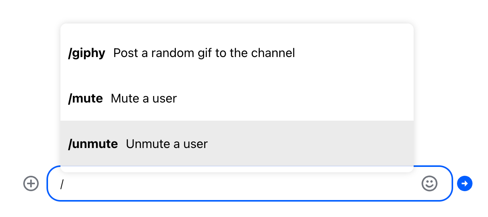
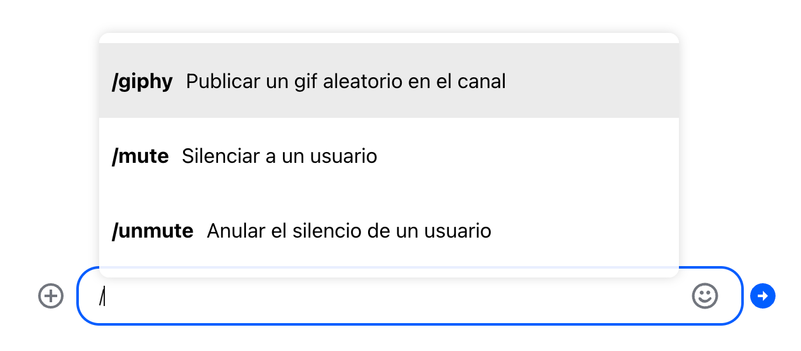
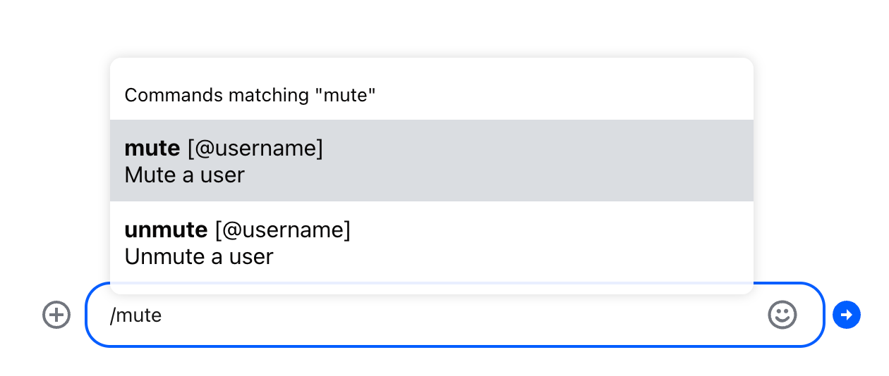
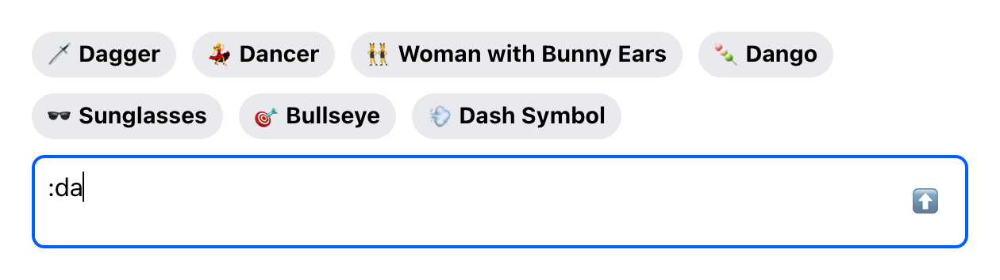
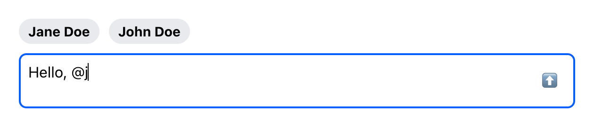
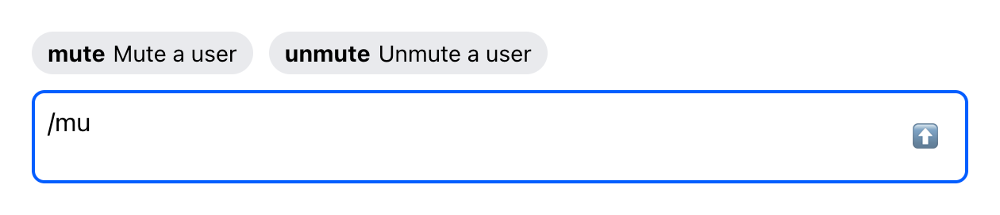

import Tabs from '@theme/Tabs';
import TabItem from '@theme/TabItem';

One of the advanced features of the message input is autocompletion support. By default, it
autocompletes mentions, commands and emojis.

Autocomplete suggestions are triggered by typing the special characters:

| Trigger | Action  | Example  |
| ------- | ------- | -------- |
| `@`     | mention | @user    |
| `/`     | command | /giphy   |
| `:`     | emoji   | :smiling |

The default message input component provided by the SDK supports this out of the box. When a trigger
character is typed into the message input, a list of suggested options appears:



If you want to customize the look and behavior of the suggestions list, you have two options:

1. Use the default message input provided by the SDK, and override the following components to
   customize the look and feel of the suggestion list:

   - [`AutocompleteSuggestionItem`](../../components/contexts/component-context.mdx#autocompletesuggestionitem)
   - [`AutocompleteSuggestionList`](../../components/contexts/component-context.mdx#autocompletesuggestionlist)

2. Implement the message input component from scratch, and add autocomplete functionality to it
   yourself.

Let's explore both options.

## Overriding the Suggestion Item Component

Let's start by creating a custom suggestion item component.

As usual, to override a component used by the SDK, you should pass a custom component as a prop to
the [`Channel`](../../components/core-components/channel.mdx) component in your application code. In
this case we are overriding
[`AutocompleteSuggestionItem`](../../components/contexts/component-context.mdx#autocompletesuggestionitem):

```jsx
import {
  Chat,
  Channel,
  ChannelHeader,
  ChannelList,
  MessageList,
  Thread,
  Window,
  MessageInput,
} from 'stream-chat-react';
import { SearchIndex } from 'emoji-mart';

export const App = () => (
  <Chat client={chatClient}>
    <ChannelList filters={filters} sort={sort} options={options} />
    <Channel AutocompleteSuggestionItem={CustomSuggestionItem} emojiSearchIndex={SearchIndex}>
      <Window>
        <ChannelHeader />
        <MessageList />
        <MessageInput />
      </Window>
      <Thread />
    </Channel>
  </Chat>
);
```

Since we are not overriding the entire suggestion list yet, just an item component, our custom item
component will get all the necessary data and callbacks in props - the default
`AutocompleteSuggestionList` will take care of that.

This makes the basic implementation pretty straightforward. Two things to note, though:

1. To show different previews for different item types (e.g. we want to show avatars for users and
   emoji previews for emojis) we need to put in type guards for each item type.
2. The default `AutocompleteSuggestionList` requires you to call the `onSelectHandler` callback when
   an item is focused or hovered. This is to ensure that items in the list are keyboard accessible.

<Tabs groupId="example">
<TabItem value="js" label="React">

```jsx
const CustomSuggestionItem = (props) => {
  const { item } = props;
  let children = null;

  // Item is an emoji suggestion
  if ('native' in item && typeof item.native === 'string') {
    children = (
      <>
        <span>{item.native}</span>
        {item.name}
      </>
    );
  }

  // Item is a user to be mentioned
  if (!('native' in item) && 'id' in item) {
    children = (
      <>
        <Avatar image={item.image} size={20} />
        {item.name ?? item.id}
      </>
    );
  }

  // Item is a command configured for the current channel
  if ('name' in item && 'description' in item) {
    children = (
      <>
        <strong>/{item.name}</strong>
        {item.description}
      </>
    );
  }

  return (
    <button
      type='button'
      className={`suggestion-list__item ${props.selected ? 'suggestion-list__item_selected' : ''}`}
      onFocus={() => props.onSelectHandler(item)}
      onMouseEnter={() => props.onSelectHandler(item)}
      onClick={(event) => props.onClickHandler(event, item)}
    >
      {children}
    </button>
  );
};
```

</TabItem>
<TabItem value="css" label="CSS">

```css
.suggestion-list__item {
  display: flex;
  align-items: center;
  gap: 10px;
  font: inherit;
  border: 0;
  background: none;
  padding: 20px 10px;
}

.suggestion-list__item_selected {
  background: #00000014;
}
```

</TabItem>
</Tabs>





If you are building an internationalized application, you will need to translate command
descriptions and arguments. Translations for all of the supported languages are provided with the
SDK. You can access them by using the translation helper function provided in the
[`TranslationContext`](../theming/translations.mdx). All you need to do is to query the translation
with the right key: `<command-name>-command-description` for the description, and
`<command-name>-command-args` for the arguments (you can always refer to our
[translation files](https://github.com/GetStream/stream-chat-react/blob/master/src/i18n/es.json) to
check if the key is correct).

```jsx
// In CustomSuggestionItem component:
const { t } = useTranslationContext();

// Item is a command configured for the current channel
if ('name' in item && 'description' in item) {
  children = (
    <>
      <strong>/{item.name}</strong>
      {t(`${item.name}-command-description`, {
        defaultValue: item.description,
      })}
    </>
  );
}
```



The English (US) translation is loaded from the Stream backend as part of the channel config object,
and is not part of the translation resources, so we explicitly set it as the fallback value.

## Overriding the Suggestion List Component

If you want to further customize the default behavior of the suggestion list, you can override the
entire list component.

This is an easy way to add a header or footer to the list. You don't have to reimplement the whole
list component, just create a small wrapper:

<Tabs groupId="example">
<TabItem value="js" label="React">

```jsx
import { DefaultSuggestionList } from 'stream-chat-react';

const SuggestionListWithHeader = (props) => {
  let header = '';

  if (props.currentTrigger === '@') {
    header = 'Users';
  }

  if (props.currentTrigger === '/') {
    header = 'Commands';
  }

  if (props.currentTrigger === ':') {
    header = 'Emoji';
  }

  if (props.value && props.value.length > 1) {
    header += ` matching "${props.value.slice(1)}"`;
  }

  return (
    <>
      <div className='suggestion-list__header'>{header}</div>
      <DefaultSuggestionList {...props} />
    </>
  );
};
```

</TabItem>
<TabItem value="css" label="CSS">

```css
.suggestion-list__header {
  padding: 10px;
  font-size: 0.9em;
}
```

</TabItem>
</Tabs>

This wrapper uses two props (provided to your component by the default message input component) to
construct a header: `currentTrigger` contains the special character that triggered autocomplete, and
`value` contains the query the user has typed so far.

Then override the
[`AutocompleteSuggestionList`](../../components/contexts/component-context.mdx#autocompletesuggestionlist)
list at the [`Channel`](../../components/core-components/channel.mdx) level, and you're done:

```jsx
import {
  Chat,
  Channel,
  ChannelHeader,
  ChannelList,
  MessageList,
  Thread,
  Window,
  MessageInput,
} from 'stream-chat-react';
import { SearchIndex } from 'emoji-mart';

export const App = () => (
  <Chat client={chatClient}>
    <ChannelList filters={filters} sort={sort} options={options} />
    <Channel AutocompleteSuggestionList={SuggestionListWithHeader} emojiSearchIndex={SearchIndex}>
      <Window>
        <ChannelHeader />
        <MessageList />
        <MessageInput />
      </Window>
      <Thread />
    </Channel>
  </Chat>
);
```



Or you can go deeper and reimplement the entire list component from scratch. Note that in this case
it's up to you to handle the interactions and accessibility. This example implementation is a good
starting point, but it doesn't handle any keyboard interactions:

<Tabs groupId="example">
<TabItem value="js" label="React">

```jsx
const CustomSuggestionList = (props) => {
  const [selectedIndex, setSelectedIndex] = useState(0);

  if (selectedIndex >= props.values.length && selectedIndex !== 0) {
    setSelectedIndex(0);
  }

  const handleClick = (item) => {
    props.onSelect(props.getTextToReplace(item));
  };

  return (
    <ul className='suggestion-list'>
      {props.values.map((item, index) => (
        <li key={index} className='suggestion-list__item-container'>
          <CustomSuggestionItem
            item={item}
            selected={index === selectedIndex}
            onSelectHandler={() => setSelectedIndex(index)}
            onClickHandler={() => handleClick(item)}
          />
        </li>
      ))}
    </ul>
  );
};
```

</TabItem>
<TabItem value="css" label="CSS">

```css
.suggestion-list {
  list-style: none;
  padding: 0;
  margin: 0;
}

.suggestion-list__item {
  display: flex;
  align-items: center;
  gap: 10px;
  width: 100%;
  font: inherit;
  border: 0;
  background: none;
  padding: 20px 10px;
}

.suggestion-list__item_selected {
  background: #00000014;
}
```

</TabItem>
</Tabs>

## Implementing Autocompletion for Custom Message Input

Finally, if you are implementing the entire message input component
[from scratch](../theming/input-ui.mdx), it's up to you to build the autocomplete functionality. The
good news is that the
[`autocompleteTriggers`](../../components/contexts/message-input-context.mdx#autocompletetriggers)
value in the `MessageInputContext` provides a lot of reusable functionality. The bad news is that
properly implementing autocomplete is still a lot of work.

Let's try to tackle that. We'll start with the simple message input implementation from the
[Message Input UI cookbook](../theming/input-ui.mdx):

```jsx
import { useMessageInputContext } from 'stream-chat-react';

const CustomMessageInput = () => {
  const { text, handleChange, handleSubmit } = useMessageInputContext();

  return (
    <div className='message-input'>
      <textarea value={text} className='message-input__input' onChange={handleChange} />
      <button type='button' className='message-input__button' onClick={handleSubmit}>
        ⬆️
      </button>
    </div>
  );
};
```

The
[`autocompleteTriggers`](../../components/contexts/message-input-context.mdx#autocompletetriggers)
object is a map between special characters that trigger autocompletion suggestions and some useful
functions:

- `dataProvider` returns (via a callback) the list of suggestions, given the current query (the text
  after the trigger)
- `callback` is the action that should be called when a suggestion is selected (e.g. when a user
  mention is selected, it modifies the message payload to include the mention)
- `output` function returns the replacement text, given one of the items returned by the
  `dataProvider`

The keys of the `autocompleteTriggers` are the characters that should trigger autocomplete
suggestions.

We'll start by using the `dataProvider` to display the list of suggestions once the trigger
character is entered by the user. We use a (memoized) regular expression to find trigger characters,
and then we query the `dataProvider` for suggestions.

When the suggestions are ready, the `dataProvider` invokes a callback, where we update the current
suggestion list. We must be careful not to run into a race condition here, so before the update, we
check to see if the input has changed since we queried the suggestions.

Finally, we render the suggestion list:

<Tabs groupId="example">
<TabItem value="js" label="React">

```jsx
import { useMessageInputContext } from 'stream-chat-react';

function CustomMessageInput() {
  const {
    text,
    autocompleteTriggers,
    handleChange: onChange,
    handleSubmit,
  } = useMessageInputContext();

  const inputRef = useRef < HTMLTextAreaElement > null;
  const [trigger, setTrigger] = (useState < string) | (null > null);
  const [suggestions, setSuggestions] = useState([]);

  const triggerQueryRegex = useMemo(() => {
    if (!autocompleteTriggers) {
      return null;
    }

    const triggerCharacters = Object.keys(autocompleteTriggers);
    // One of the trigger characters, followed by one or more non-space characters
    return new RegExp(String.raw`([${triggerCharacters}])(\S+)`);
  }, [autocompleteTriggers]);

  const handleChange = (event) => {
    onChange(event);

    if (autocompleteTriggers && triggerQueryRegex) {
      const input = event.currentTarget;
      const updatedText = input.value;
      const textBeforeCursor = updatedText.slice(0, input.selectionEnd);
      const match = textBeforeCursor.match(triggerQueryRegex);

      if (!match) {
        setTrigger(null);
        setSuggestions([]);
        return;
      }

      const trigger = match[1];
      const query = match[2];

      // Query the dataProvider for the suggestions
      autocompleteTriggers[trigger].dataProvider(query, updatedText, (suggestions) => {
        // Unless the input has changed, update the suggestion list
        if (input.value === updatedText) {
          setTrigger(match[0]);
          setSuggestions(suggestions);
        }
      });
    }
  };

  return (
    <div className='message-input'>
      {suggestions.length > 0 && (
        <div className='suggestions'>
          {suggestions.map((item) => (
            <button className='suggestions__item'>
              {'native' in item && typeof item.native === 'string' && item.native}
              <strong>{item.name}</strong>
              {'description' in item && typeof item.description === 'string' && item.description}
            </button>
          ))}
        </div>
      )}
      <div className='message-input__composer'>
        <textarea
          ref={inputRef}
          className='message-input__input'
          value={text}
          onChange={handleChange}
        />
        <button type='button' className='message-input__button' onClick={handleSubmit}>
          ⬆️
        </button>
      </div>
    </div>
  );
}
```

</TabItem>
<TabItem value="css" label="CSS">

```css
.message-input {
  margin: 16px;
}

.message-input__composer {
  display: flex;
  align-items: center;
  border: 2px solid #00000029;
  border-radius: 8px;
}

.message-input__composer:has(.message-input__input:focus) {
  border-color: #005fff;
}

.message-input__input {
  flex-grow: 1;
  border: 0;
  outline: 0;
  background: none;
  font: inherit;
  padding: 8px;
  resize: none;
}

.message-input__button {
  border: 1px solid transparent;
  outline: 0;
  background: none;
  font: inherit;
  border-radius: 4px;
  margin: 8px;
  padding: 8px;
  cursor: pointer;
}

.message-input__button:hover {
  background: #fafafa;
  border-color: #00000014;
}

.message-input__button:focus,
.message-input__button:focus-within {
  border-color: #005fff;
}

.suggestions {
  display: flex;
  gap: 10px;
  flex-wrap: wrap;
  margin-bottom: 10px;
  font-size: 0.9em;
}

.suggestions__item {
  font: inherit;
  display: flex;
  gap: 5px;
  padding: 5px 10px;
  border-radius: 20px;
  border: 0;
  background: #e9eaed;
  cursor: pointer;
}
```

</TabItem>
</Tabs>





But we are not done yet. Displaying suggestions is only half of the puzzle. The second half is
reacting when the user selects one of the suggestions.

When the user selects a suggestion, we should do two things:

1. Call the `callback` for the current trigger. This will, for example, update the message payload
   with a user mention.
2. Examine the return value of the `output` for the selected suggestion, and update the message
   input text accordingly.

The `output` returns an object that looks something like this:

```json
{
  "text": "replacement text",
  "caretPosition": "next"
}
```

The `text` property tells us what to replace the current trigger with, and the `caretPosition`
property tells us where the cursor should end up after the update: either before or after the
inserted replacement.

Let's add a handler for the click event on the suggestion:

```js
const handleSuggestionClick = (item) => {
  if (autocompleteTriggers && trigger) {
    const { callback, output } = autocompleteTriggers[trigger[0]];
    callback?.(item);
    const replacement = output(item);

    if (replacement) {
      const start = text.indexOf(trigger);
      const end = start + trigger.length;
      const caretPosition =
        replacement.caretPosition === 'start' ? start : start + replacement.text.length;

      const updatedText = text.slice(0, start) + replacement.text + text.slice(end);
      flushSync(() => setText(updatedText));
      inputRef.current?.focus();
      inputRef.current?.setSelectionRange(caretPosition, caretPosition);
    }
  }
};
```

And there you have it, the complete example that you can use as a starting point for your own
autocomplete implementation:

<Tabs groupId="example">
<TabItem value="js" label="React">

```jsx
import { useMessageInputContext } from 'stream-chat-react';

function CustomMessageInput() {
  const {
    text,
    autocompleteTriggers,
    handleChange: onChange,
    handleSubmit,
  } = useMessageInputContext();

  const inputRef = useRef < HTMLTextAreaElement > null;
  const [trigger, setTrigger] = (useState < string) | (null > null);
  const [suggestions, setSuggestions] = useState([]);

  const triggerQueryRegex = useMemo(() => {
    if (!autocompleteTriggers) {
      return null;
    }

    const triggerCharacters = Object.keys(autocompleteTriggers);
    return new RegExp(String.raw`([${triggerCharacters}])(\S+)`);
  }, [autocompleteTriggers]);

  const handleChange = (event) => {
    onChange(event);

    if (autocompleteTriggers && triggerQueryRegex) {
      const input = event.currentTarget;
      const updatedText = input.value;
      const textBeforeCursor = updatedText.slice(0, input.selectionEnd);
      const match = textBeforeCursor.match(triggerQueryRegex);

      if (!match) {
        setTrigger(null);
        setSuggestions([]);
        return;
      }

      const trigger = match[1];
      const query = match[2];

      autocompleteTriggers[trigger].dataProvider(query, updatedText, (suggestions) => {
        if (input.value === updatedText) {
          setTrigger(match[0]);
          setSuggestions(suggestions);
        }
      });
    }
  };

  const handleSuggestionClick = (item) => {
    if (autocompleteTriggers && trigger) {
      const { callback, output } = autocompleteTriggers[trigger[0]];
      callback?.(item);
      const replacement = output(item);

      if (replacement) {
        const start = text.indexOf(trigger);
        const end = start + trigger.length;
        const caretPosition =
          replacement.caretPosition === 'start' ? start : start + replacement.text.length;

        const updatedText = text.slice(0, start) + replacement.text + text.slice(end);
        flushSync(() => setText(updatedText));
        inputRef.current?.focus();
        inputRef.current?.setSelectionRange(caretPosition, caretPosition);
      }
    }
  };

  return (
    <div className='message-input'>
      {suggestions.length > 0 && (
        <div className='suggestions'>
          {suggestions.map((item) => (
            <button className='suggestions__item' onClick={() => handleSuggestionClick(item)}>
              {'native' in item && typeof item.native === 'string' && item.native}
              <strong>{item.name}</strong>
              {'description' in item && typeof item.description === 'string' && item.description}
            </button>
          ))}
        </div>
      )}
      <div className='message-input__composer'>
        <textarea
          ref={inputRef}
          className='message-input__input'
          value={text}
          onChange={handleChange}
        />
        <button type='button' className='message-input__button' onClick={handleSubmit}>
          ⬆️
        </button>
      </div>
    </div>
  );
}
```

</TabItem>
<TabItem value="css" label="CSS">

```css
.message-input {
  margin: 16px;
}

.message-input__composer {
  display: flex;
  align-items: center;
  border: 2px solid #00000029;
  border-radius: 8px;
}

.message-input__composer:has(.message-input__input:focus) {
  border-color: #005fff;
}

.message-input__input {
  flex-grow: 1;
  border: 0;
  outline: 0;
  background: none;
  font: inherit;
  padding: 8px;
  resize: none;
}

.message-input__button {
  border: 1px solid transparent;
  outline: 0;
  background: none;
  font: inherit;
  border-radius: 4px;
  margin: 8px;
  padding: 8px;
  cursor: pointer;
}

.message-input__button:hover {
  background: #fafafa;
  border-color: #00000014;
}

.message-input__button:focus,
.message-input__button:focus-within {
  border-color: #005fff;
}

.suggestions {
  display: flex;
  gap: 10px;
  flex-wrap: wrap;
  margin-bottom: 10px;
  font-size: 0.9em;
}

.suggestions__item {
  font: inherit;
  display: flex;
  gap: 5px;
  padding: 5px 10px;
  border-radius: 20px;
  border: 0;
  background: #e9eaed;
  cursor: pointer;
}
```

</TabItem>
</Tabs>
