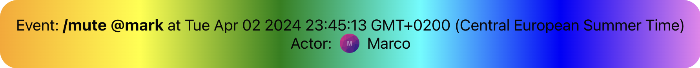

import Tabs from '@theme/Tabs';
import TabItem from '@theme/TabItem';

A system message is a message generated by a system event, such as banning or muting a user. These are sent from the backend and displayed via the [`VirtualizedMessageList`](../../components/core-components/virtualized-list.mdx) and [`MessageList`](../../components/core-components/message-list.mdx) components automatically. In this guide, we will demonstrate how to create and override the default component.

### Default System Message Component

For reference, the default system message component, [`EventComponent`](https://github.com/GetStream/stream-chat-react/blob/master/src/components/EventComponent/EventComponent.tsx) (image below) displays all pertinent information about the event that occurred. The two list components display these messages only if message is of type `system` (`message.type === "system"`).


### Custom System Message Component

Our custom component will display the message text, date, and the actor (user who triggered the event) with added styling. For this complete override of the default component, we will utilize the [`MessageSystem`](../../components/core-components/channel.mdx#messagesystem) prop on [`Channel`](../../components/core-components/channel.mdx). This adds our custom component to the [`ComponentContext`](../../components/contexts/component-context.mdx) where it
is then pulled for use in the lists when needed.

:::note
To see your custom component in action, try muting a user by using the `/` command. For example, type `/mute` followed by a user mention, `@`. These commands must be enabled in the [Dashboard](https://dashboard.getstream.io/).
:::

<Tabs groupId="example">
<TabItem value="js" label="React">

```jsx
import { Avatar as DefaultAvatar, Channel } from 'stream-chat-react';
import type { EventComponentProps } from 'stream-chat-react';

const CustomSystemMessage = (props: EventComponentProps) => {
  const { Avatar = DefaultAvatar, message } = props;

  const { created_at = '', text, user } = message;
  const date = created_at.toString();

  return (
    <div className='custom-system-message'>
      <div>
        Event: <strong>{text?.trim()}</strong> at {date}
      </div>
      <div className='custom-system-message__actor'>
        Actor:
        <Avatar image={user?.image} shape='square' size={20} />
        {user?.name}
      </div>
    </div>
  );
};

export const ChannelWrapper = ({ children }) => (
  <Channel MessageSystem={CustomSystemMessage}>{children}</Channel>
);
```

</TabItem>

<TabItem value="css" label="CSS">

```css
.custom-system-message__actor {
  display: flex;
  gap: 0.5rem;
}

.custom-system-message {
  padding: 1rem;
  display: flex;
  flex-direction: column;
  align-items: center;
  border-radius: var(--str-chat__border-radius-md);
  background: red; /* For browsers that do not support gradients */
  background: -webkit-linear-gradient(
    left,
    orange,
    yellow,
    green,
    cyan,
    blue,
    violet
  ); /* For Safari 5.1 to 6.0 */
  background: -o-linear-gradient(
    right,
    orange,
    yellow,
    green,
    cyan,
    blue,
    violet
  ); /* For Opera 11.1 to 12.0 */
  background: -moz-linear-gradient(
    right,
    orange,
    yellow,
    green,
    cyan,
    blue,
    violet
  ); /* For Firefox 3.6 to 15 */
  background: linear-gradient(
    to right,
    orange,
    yellow,
    green,
    cyan,
    blue,
    violet
  ); /* Standard syntax (must be last) */
}
```

</TabItem>

</Tabs>


