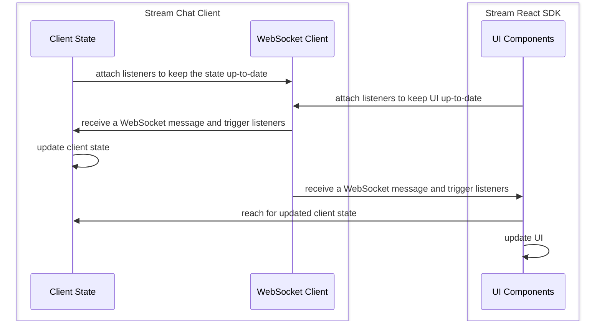

Most of the application state which is the main driver behind the UI changes of our chat SDK lives within our low-level client (LLC) - [`StreamChat`](https://github.com/GetStream/stream-chat-js) - more specifically client and channel instances and is **NOT REACTIVE** - our React SDK makes these state stores reactive by listening to the same events client does and copies it with the help of `useState` API after it has been changed. Optimistic updates - if applicable - are handled by and are local only to React SDK.

This is how the SDK state pipeline looks like behind the scenes:



## Active Channel & Channel State

The SDK comes with [`ChatContext`](../components/contexts/chat-context.mdx) which holds (among other things) currently active channel instance and forwards LLC instance passed to the [`Chat`](../components/core-components/chat.mdx) component.
Before you can access the _reactive_ channel state you'll need to set the channel instance as active. The channel becomes active when:

- it's user-selected in the [`ChannelList`](../components/core-components/channel-list.mdx) component (if you're using our ([default setup](../basics/getting-started.mdx#your-first-app-with-stream-chat-react)), you probably already have `ChannelList` in your application)
- it's passed to the `channel` prop of the [`Channel`](../components/core-components/channel.mdx) component

  ```tsx
  import { useState, useEffect } from 'react';
  import { Channel, useChatContext } from 'stream-chat-react';

  export const ChannelWrapper = ({ channelId, channelType = 'messaging', children }) => {
    const [activeChannel, setActiveChannel] = useState(undefined);
    const { client } = useChatContext();

    useEffect(() => {
      if (!channelId) return;

      const channel = client.channel(channelType, channelId);

      setActiveChannel(channel);
    }, [channelId, channelType]);

    return <Channel channel={activeChannel}>{children}</Channel>;
  };
  ```

- it's set as active by calling the [`setActiveChannel`](../components/contexts/chat-context.mdx#setactivechannel) function coming from the [`ChatContext`](../components/contexts/chat-context.mdx) (this function is used by [`ChannelList`](../components/core-components/channel-list.mdx) behind the scenes)

  ```tsx
  import { useEffect } from 'react';
  import { useCreateChatClient, useChatContext, Chat, Channel } from 'stream-chat-react';

  const ActiveChannelSetter = ({ channelId, channelType }) => {
    const { client, setActiveChannel } = useChatContext();

    useEffect(() => {
      const channel = client.channel(channelType, channelId);
      setActiveChannel(channel);
    }, [channelType, channelId]);

    return null;
  };

  const App = () => {
    const client = useCreateChatClient(userData);

    if (!client) return <div>Loading...</div>;

    return (
      <Chat client={client}>
        <ActiveChannelSetter channelId='random' channelType='messaging' />
        <Channel>{'...other components...'}</Channel>
      </Chat>
    );
  };
  ```

:::note
You can use either `channel` prop on the [`Channel`](../components/core-components/channel.mdx) component or [`setActiveChannel`](../components/contexts/chat-context.mdx#setactivechannel) function. You cannot use both at the same time.
:::

Currently active [channel state](https://github.com/GetStream/stream-chat-react/blob/master/src/context/ChannelStateContext.tsx#L36-L56) and channel instance can be accessed through the [`ChannelStateContext`](../components/contexts/channel-state-context.mdx) with the help of the [`useChannelStateContext`](../components/contexts/channel-state-context.mdx#basic-usage) hook - meaning any component which is either direct or indirect child of the [`Channel`](../components/core-components/channel.mdx) component can access such state.

The example bellow shows how to reach `members` and `channel` property coming from the channel state:

```tsx
import { useEffect } from 'react';
import { Channel, useChannelStateContext } from 'stream-chat-react';

const MembersCount = () => {
  const { members, channel } = useChannelStateContext();

  useEffect(() => {
    console.log(`Currently active channel changed, channelId: ${channel.id}`);
  }, [channel]);

  return <div>{Object.keys(members).length}</div>;
};

const ChannelWrapper = () => (
  <Channel>
    <MembersCount />
  </Channel>
);
```

## Channel List State

[`ChannelList`](../components/core-components/channel-list.mdx) component is a standalone component which (unsurprisingly) holds and manages list of channels. You can access loaded `channels` from [`ChannelListContext`](../components/contexts/channel-list-context.mdx) with the help of `useChannelListContext` hook. Any component which is either direct or indirect child of the [`ChannelList`](../components/core-components/channel-list.mdx) component can access such state ([Channel Preview](../components/utility-components/channel-preview-ui.mdx) for example).

```tsx
import { ChannelList, ChannelPreviewMessenger } from 'stream-chat-react';
import type { ChannelListProps } from 'stream-chat-react';

const CustomPreviewUI = (props) => {
  const { channels } = useChannelListContext();

  return <ChannelPreviewMessenger {...props} />;
};

export const CustomChannelList = (props: ChannelListProps) => {
  return <ChannelList Preview={CustomPreviewUI} {...props} />;
};
```

## Thread and ThreadManager

With the new [threads feature]() we've decided to refresh our state management and moved to a subscribable POJO with selector based system to make developer experience better when it came to rendering information provided by our `StreamChat` client.

:::note
This change is currently only available within `StreamChat.threads` but will be reused across the whole SDK later on.
:::

### Why POJO (State Object)

Our SDK holds and provides A LOT of information to our integrators and each of those integrators sometimes require different data or forms of data to display to their users. All of this important data now lives within something we call state object and through custom-tailored selectors our integrators can access the combination of data they require without any extra overhead and performance to match.

### What are Selectors

Selectors are functions provided by integrators that run whenever state object changes. These selectors should return piece of that state that is important for the appropriate component that renders that piece of information. Selectors itself should not do any heavy data computations that could resolve in generating new data each time the selector runs (arrays and objects), use pre-built hooks with computed state values or build your own if your codebase requires it.

#### Rules of Selectors

1. Selectors should return array of data sorted by their "change factor"; meaning values that change often should come first for the best performance.

```ts
const selector = (nextValue: ThreadManagerState) => [
  nextValue.unreadThreadsCount, // <-- changes often
  nextValue.active, // <-- changes less often
  nextvalue.lastConnectionDownAt, // <-- changes rarely
];
```

2. Selectors should live outside components scope or should be memoized if it requires "outside" information (`userId` for `read` object for example). Not memoizing selectors (or not stabilizing them) will lead to bad performance as each time your component re-renders, the selector function is created anew and `useSimpleStateStore` goes through unsubscribe and resubscribe process unnecessarily.

```tsx
// ❌ not okay
const Component1 = () => {
  const [latestReply] = useThreadState((nextValue: ThreadState) => [
    nextValue.latestReplies.at(-1),
  ]);

  return <div>{latestReply.text}</div>;
};

// ✅ okay
const selector = (nextValue: ThreadState) => [nextValue.latestReplies.at(-1)];

const Component2 = () => {
  const [latestReply] = useThreadState(selector);

  return <div>{latestReply.text}</div>;
};

// ✅ also okay
const Component3 = ({ userId }: { userId: string }) => {
  const selector = useCallback(
    (nextValue: ThreadState) => [nextValue.read[userId].unread_messages],
    [userId],
  );

  const [unreadMessagesCount] = useThreadState(selector);

  return <div>{unreadMessagesCount}</div>;
};
```

3. Break your components down to the smallest reasonable parts that each take care of the apropriate piece of state if it makes sense to do so.

### Accessing Reactive State

Our SDK currently allows to access two of these state structures - in [Thread]() and [ThreadManager]() instances under `state` property.

#### Vanilla

```ts
import { StreamChat } from 'stream-chat';

const client = new StreamChat(/*...*/);

// calls console.log with the whole state object whenever it changes
client.threads.state.subscribe(console.log);

let latestThreads;
client.threads.state.subscribeWithSelector(
  // called each time theres a change in the state object
  (nextValue) => [nextValue.threads],
  // called only when threads change (selected value)
  ([threads]) => {
    latestThreads = threads;
  },
);

// returns lastest state object
const state = client.threads.state.getLatestValue();

const [thread] = latestThreads;

// thread instances come with the same functionality
thread?.state.subscribe(/*...*/);
thread?.state.subscribeWithSelector(/*...*/);
thread?.state.getLatestValue(/*...*/);
```

#### useSimpleStateStore Hook

For the ease of use - the React SDK comes with the appropriate state acesss hook which wraps `SimpleStateStore.subscribeWithSelector` API for the React-based applications.

```tsx
import { useSimpleStateStore } from 'stream-chat-react';
import type { ThreadManagerState } from 'stream-chat';

const selector = (nextValue: ThreadManagerState) => [nextValue.threads] as const;

const CustomThreadList = () => {
  const { client } = useChatContext();
  const [threads] = useSimpleStateStore(client.threads.state, selector);

  return (
    <ul>
      {threads.map((thread) => (
        <li key={thread.id}>{thread.id}</li>
      ))}
    </ul>
  );
};
```

#### useThreadState and useThreadManagerState

Both of these hooks use `useSimpleStateStore` under the hood but access their respective states through appropriate contexts; for `ThreadManagerState` it's `ChatContext` (accessing `client.threads.state`) and for `ThreadState` it's `ThreadListItemContext` first and `ThreadContext` second meaning that the former is prioritized. While these hooks make it sligthly easier for our integrators to reach reactive state

```ts
// memoized or living outside component's scope
const threadStateSelector = (nextValue: ThreadState) => [nextValue.replyCount] as const;
const threadManagerStateSelector = (nextValue: ThreadState) => [nextValue.threads.length] as const;

const MyComponent = () => {
  const [replyCount] = useThreadState(threadStateSelector);
  const [threadsCount] = useThreadManagerState(threadManagerStateSelector);

  return null;
};
```

## Conclusion

This guide covers the biggest and most important state stores, see other React stateful contexts exported by our SDK for more information.

Mentioned in this article:

- [`ChannelStateContext`](../components/contexts/channel-state-context.mdx)
- [`ChatContext`](../components/contexts/chat-context.mdx)
- [`ChannelListContext`](../components/contexts/channel-list-context.mdx)

Other data/action providers:

- [`ComponentContext`](../components/contexts/component-context.mdx)
- [`ChannelActionContext`](../components/contexts/channel-action-context.mdx)
- [`MessageContext`](../components/contexts/message-context.mdx)
- [`MessageInputContext`](../components/contexts/message-input-context.mdx)
- [`MessageListContext`](../components/contexts/message-list-context.mdx)
