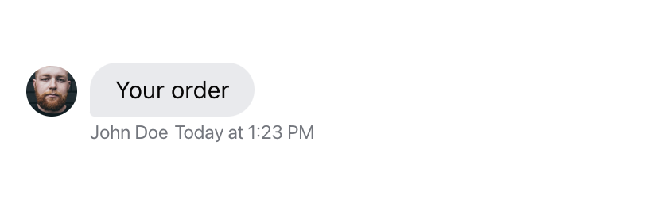
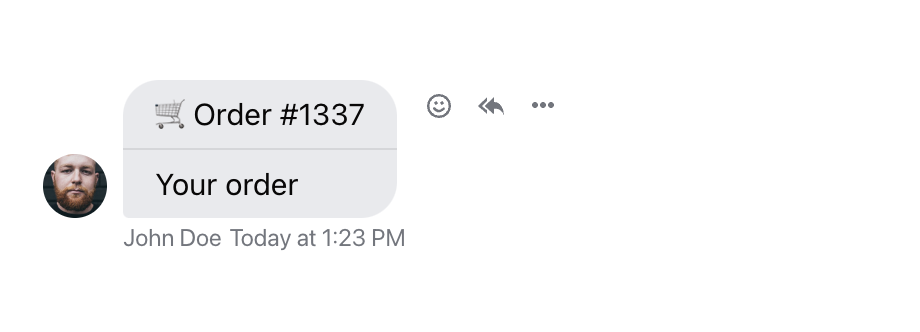
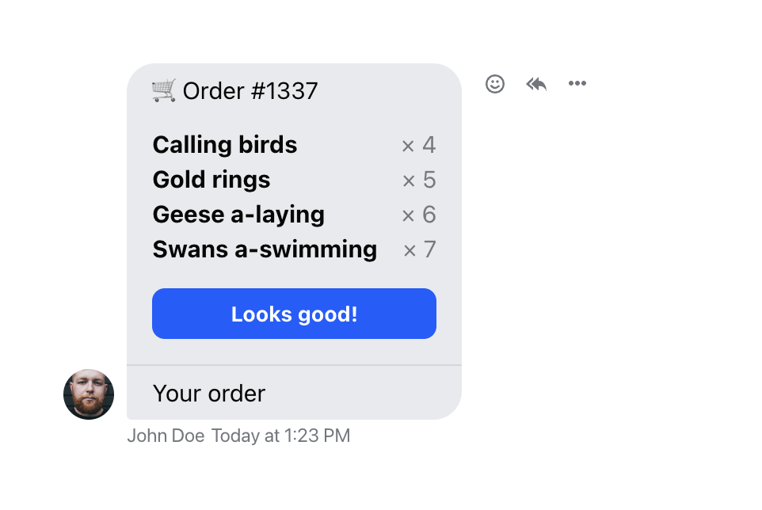
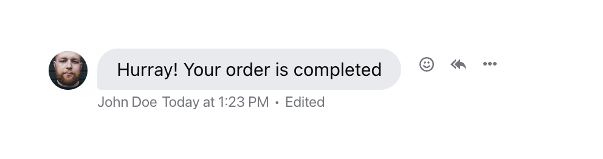
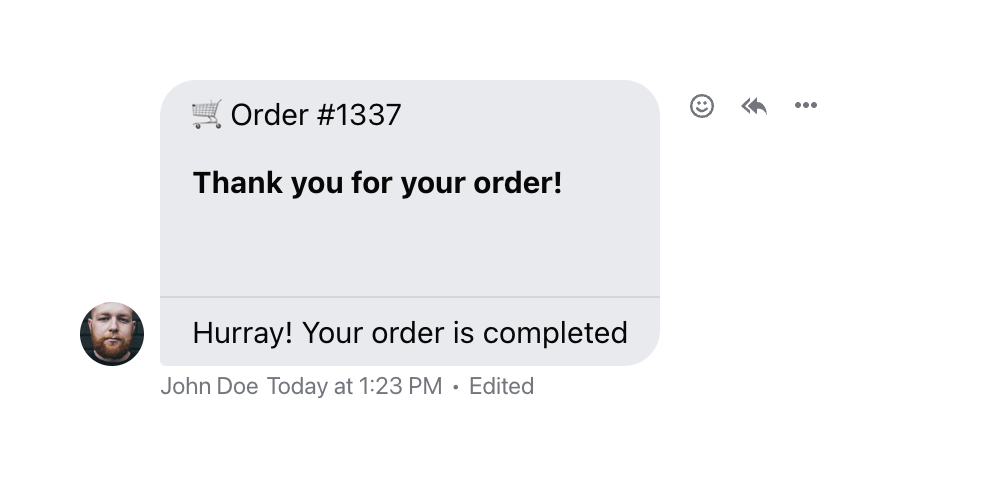

import Tabs from '@theme/Tabs';
import TabItem from '@theme/TabItem';

Custom attachment types are a great way to extend chat functionality. Any
component can be rendered to represent your custom attachment, so you can
provide rich user experiences right in the chat.

In this example, we will create a custom attachment type to allow users to
confirm and pay for their order without leaving the chat.

## Prerequisites

We assume that you have already created an application in the dashboard, and
have an API key and secret ready. You should also have a messaging channel ready
(ours is called `messaging:test-channel`), and two users as members of the
channel. This is easy to set up using the Explorer in your dashboard.

In the code samples below the user with the ID `john-doe` plays the role of a
sales representative, and `jane-doe` plays the role of a customer.

## Sending a Custom Attachment

First, let's send a message with a custom attachment type. An attachment can
have any JSON payload. In our case, the payload contains the order number:

```json
{
  "type": "order",
  "orderId": 1337
}
```

We can send a message using our Node.js client with a simple script. In
real use cases, it's either your backend or admin/agent frontend that will send
a message with a custom attachment.

```js
// send-order.mjs:
import { StreamChat } from 'stream-chat';

const serverClient = StreamChat.getInstance(API_KEY, API_SECRET);
const channel = serverClient.channel('messaging', 'test-channel');
await channel.sendMessage({
  text: 'Your order',
  attachments: [
    {
      type: 'order',
      orderId: 1337,
    },
  ],
  user_id: 'john-doe',
});
```

You'll need to provide your own API key and secret, and replace the channel and
user id if necessary. Then you'll be able to run the script:

```sh
node send-order.mjs
```

As a result, you should see the message saying "Your order" in the channel:



However, you'll notice that the attachment itself is not rendered. This is
because the SDK doesn't yet know how to display this custom attachment type.
We'll fix that next.

## Rendering Custom Attachment Types

To support rendering custom attachment types, we'll create a small wrapper
around the default `Attachment` component. The wrapper will only be responsible
for rendering our custom attachment type, the rest we'll just pass on to the
default implementation:

<Tabs groupId="example">
<TabItem value="js" label="React">

```jsx
import { Attachment } from 'stream-chat-react';

const CustomAttachment = (props) => {
  if (props.attachments[0].type === 'order') {
    return <OrderAttachment orderId={props.attachments[0].orderId} />;
  }

  return <Attachment {...props} />;
};

const OrderAttachment = (props) => {
  return <div className='order'>🛒 Order #{props.orderId}</div>;
};
```

</TabItem>
<TabItem value="css" label="CSS">

```css
.order {
  padding: 8px 16px 16px;
  border-bottom: 1px solid #00000016;
}
```

</TabItem>
</Tabs>

As usual, to override the default `Attachment` component with our wrapper, we
pass it as a prop to the `Channel` component:

```jsx
import { Channel } from 'stream-chat-react';

<Channel Attachment={CustomAttachment}>{/* ... */}</Channel>;
```



At this point, you'll want to add your custom logic to your component. You will
probably want to fetch the order data, and integrate payment system components
(like [React Stripe.js](https://docs.stripe.com/stripe-js/react)). In our
example, we'll make some (fake) requests to mimic the order data fetching:

<Tabs groupId="example">
<TabItem value="js" label="React">

```jsx
import { useQuery } from '@tanstack/react-query';

const OrderAttachment = (props) => {
  const { data, isPending: isOrderLoading } = useQuery({
    queryKey: ['order', props.orderId],
    queryFn: async () => {
      const res = await fetch(`/api/order/${props.orderId}`);
      return await res.json();
    },
  });

  return (
    <div className='order'>
      <h3 className='order-header'>🛒 Order #{props.orderId}</h3>
      {isOrderLoading ? (
        <div className='order-placeholder'>Loading...</div>
      ) : (
        <ul className='order-product-list'>
          {data.products.map((product) => (
            <li key={product.id} className='order-product'>
              {product.name}
              <span className='order-amount'>&times; {product.amount}</span>
            </li>
          ))}
        </ul>
      )}
      <button type='button' className='order-confirm'>
        Looks good!
      </button>
    </div>
  );
};
```

</TabItem>
<TabItem value="css" label="CSS">

```css
.order {
  padding: 8px 16px 16px;
  border-bottom: 1px solid #00000016;
}

.order-header {
  font-size: 1em;
  font-weight: normal;
  margin: 0;
}

.order-product-list {
  list-style: none;
  margin: 16px 0;
  padding: 0;
}

.order-product {
  font-weight: bold;
}

.order-product:not(:last-child) {
  margin-bottom: 4px;
}

.order-amount {
  float: right;
  margin-left: 2ex;
  font-weight: normal;
  opacity: 0.5;
}

.order-confirm {
  background: #005fff;
  color: #fff;
  font-weight: bold;
  padding: 8px 16px;
  border: 0;
  border-radius: 8px;
  cursor: pointer;
  width: 100%;
}

.order-placeholder {
  margin: 16px 0 32px;
  font-weight: bold;
}
```

</TabItem>
</Tabs>



Once the order is complete, our custom component can display a special UI to
prevent double payments. Or, your backend can update the message to replace the
attachment with another one:

```jsx
import { useQuery, useMutation } from '@tanstack/react-query';
import { useMessageContext } from 'stream-chat-react';

const OrderAttachment = (props) => {
  const { message } = useMessageContext();

  const { data, isPending: isOrderLoading } = useQuery({
    queryKey: ['order', props.orderId],
    queryFn: async () => {
      const res = await fetch(`/api/order/${props.orderId}`);
      return await res.json();
    },
  });

  const { mutate: confirmOrder, isPending: isOrderConfirming } = useMutation({
    mutateFn: async () => {
      await fetch(`/api/order/${props.orderId}/confirm`, {
        method: 'POST',
        body: JSON.stringify({ messageId: message.id }),
      });
    },
  });

  return (
    <div className='order'>
      <h3 className='order-header'>🛒 Order #{props.orderId}</h3>
      {isOrderLoading ? (
        <div className='order-placeholder'>Loading...</div>
      ) : (
        <ul className='order-product-list'>
          {data.products.map((product) => (
            <li key={product.id} className='order-product'>
              {product.name}
              <span className='order-amount'>&times; {product.amount}</span>
            </li>
          ))}
        </ul>
      )}
      <button
        type='button'
        className='order-confirm'
        disabled={isOrderConfirming}
        onClick={() => confirmOrder()}
      >
        Looks good!
      </button>
    </div>
  );
};
```

```js
// on your backend, once the order is finished:
await serverClient.updateMessage(
  {
    id: req.body.messageId,
    attachments: [
      {
        type: 'order-completed',
        orderId: 1337,
      },
    ],
    text: 'Hurray! Your order is completed',
  },
  'john-doe',
);
```



Finally, we'll add another custom attachment type to display completed orders:

```jsx
const CustomAttachment = (props) => {
  if (props.attachments[0].type === 'order') {
    return <OrderAttachment orderId={props.attachments[0].orderId} />;
  }

  if (props.attachments[0].type === 'order-completed') {
    return <OrderCompletedAttachment orderId={props.attachments[0].orderId} />;
  }

  return <Attachment {...props} />;
};

const OrderCompletedAttachment = (props) => {
  return (
    <div className='order'>
      <h3 className='order-header'>🛒 Order #{props.orderId}</h3>
      <div className='order-placeholder'>Thank you for your order!</div>
    </div>
  );
};
```



And there it is! Use this example as a starting point for your own interactive
user experiences right in the chat.
