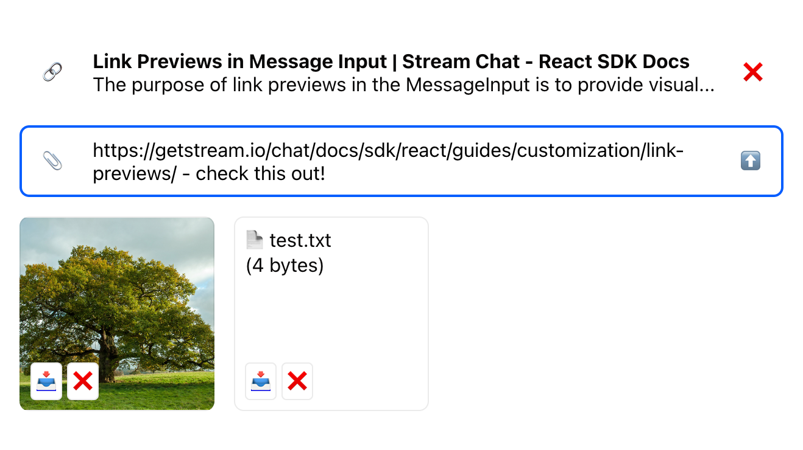
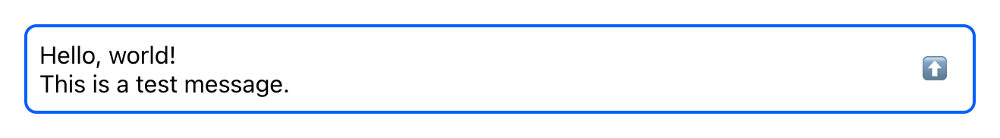
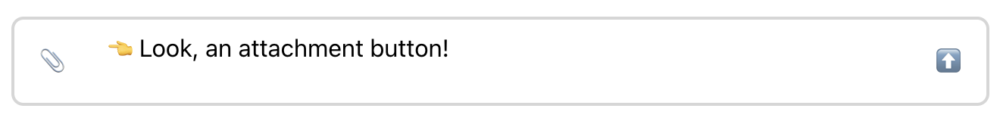
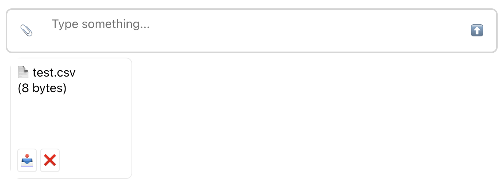
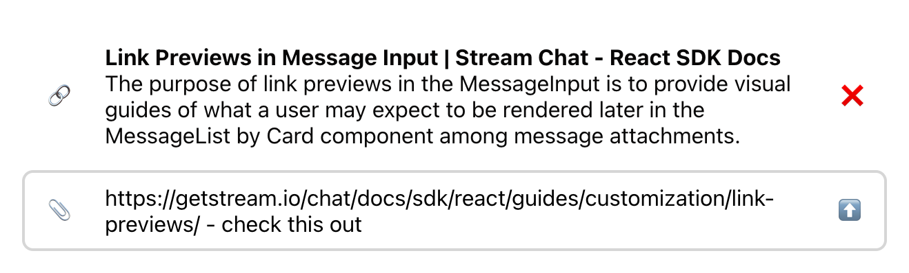
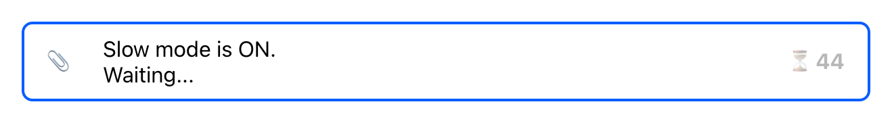

import Tabs from '@theme/Tabs';
import TabItem from '@theme/TabItem';

Message input is used for composing and editing messages. In this sense, it's a primary component
that users interact with in a chat, so it's important to get it right.

Message input is a bit more complex than it might seem at first glance. Not just a text box with a
"send" button, it has a lot of hidden features:

1. Updating the typing status
2. Uploading and previewing attachments
3. Displaying link previews
4. Auto-completing mentions, commands, emoji...



We will cover this features step by step. For now, let's start with the simplest markup possible:

<Tabs groupId="example">
<TabItem value="js" label="React">

```jsx
const CustomMessageInput = () => (
  <div className='message-input'>
    <textarea value={'Hello world'} className='message-input__input' />
    <button type='button' className='message-input__button'>
      ⬆️
    </button>
  </div>
);
```

</TabItem>
<TabItem value="css" label="CSS">

```css
.message-input {
  margin: 1rem;
}

.message-input:has(.message-input__input:focus) {
  border-color: #005fff;
}

.message-input__input {
  flex-grow: 1;
  border: 0;
  outline: 0;
  background: none;
  font: inherit;
  padding: 8px;
  resize: none;
}

.message-input__button {
  border: 1px solid transparent;
  outline: 0;
  background: none;
  font: inherit;
  border-radius: 4px;
  margin: 8px;
  padding: 8px;
  cursor: pointer;
}

.message-input__button:hover {
  background: #fafafa;
  border-color: #00000014;
}

.message-input__button:focus {
  border-color: #005fff;
}
```

</TabItem>
</Tabs>



Note that you should not render your custom message input directly, but instead pass it as a prop to
either [`Channel`](../../components/core-components/channel.mdx) or
[`MessageInput`](../../components/message-input-components/message-input.mdx) component. That way,
you can be sure that your input is wrapped with the necessary context providers, most importantly
the [`MessageInputContext`](../../components/contexts/message-input-context.mdx).

```jsx
import {
  Chat,
  Channel,
  ChannelHeader,
  ChannelList,
  MessageList,
  Thread,
  Window,
  MessageInput,
} from 'stream-chat-react';

export const App = () => (
  <Chat client={chatClient}>
    <ChannelList filters={filters} sort={sort} options={options} />
    <Channel>
      <Window>
        <ChannelHeader />
        <MessageList />
        <MessageInput Input={CustomMessageInput} />
      </Window>
      <Thread />
    </Channel>
  </Chat>
);
```

For now, our custom input doesn't do anything. The
[`MessageInputContext`](../../components/contexts/message-input-context.mdx) handles most of the
input-related state and actions, so instead of handling the state yourself, just use the provided
values and callbacks:

```jsx
import { useMessageInputContext } from 'stream-chat-react';

const CustomMessageInput = () => {
  const { text, handleChange, handleSubmit } = useMessageInputContext();

  return (
    <div className='message-input'>
      <textarea
        value={text}
        className='message-input__input'
        onChange={handleChange}
        placeholder={'Type something...'}
      />
      <button type='button' className='message-input__button' onClick={handleSubmit}>
        ⬆️
      </button>
    </div>
  );
};
```

The great thing is that the `handleChange` callback not only updates the text value, but also
detects links (if URL enrichment is enabled), and updates your typing status.

And with the `handleSubmit` callback added to the "send" button, our basic implementation is
complete - try it out!

## Uploading and Previewing Attachments

To support adding attachments to the message, we should start by adding a file input. And similar to
the "send" button, once a file is selected, we can use a callback provided in the
[`MessageInputContext`](../../components/contexts/message-input-context.mdx) to upload it as an
attachment:

```jsx
import { useMessageInputContext } from 'stream-chat-react';

const AttachmentUploadButton = () => {
  const { uploadNewFiles } = useMessageInputContext();

  function handleChange(e) {
    const files = e.currentTarget.files;

    if (files && files.length > 0) {
      uploadNewFiles(files);
      e.currentTarget.value = '';
    }
  }

  return (
    <label className='message-input__button'>
      <input type='file' className='visually-hidden' onChange={handleChange} />
      📎
    </label>
  );
};
```



There are three cases when uploads should not be allowed:

1. Uploads are disabled for the current channel. We should check the
   [`isUploadEnabled`](../../components/contexts/message-input-context.mdx#isuploadenabled) value
   from the `MessageInputContext` to make sure.
2. The maximum number of message attachments has been reached. For this we should check the
   [`maxFilesLeft`](../../components/contexts/message-input-context.mdx#maxfilesleft) value from the
   `MessageInputContext`.
3. The cool-down interval is active and user should not be permitted to send messages during this period. The remaining cooldown time can be determined by [`cooldownRemaining` value](../../components/contexts/message-input-context.mdx#cooldownremaining).

Let's add these three checks:

```jsx
import { useMessageInputContext } from 'stream-chat-react';

const AttachmentUploadButton = () => {
  const {
    cooldownRemaining,
    uploadNewFiles,
    isUploadEnabled,
    maxFilesLeft,
  } = useMessageInputContext();

  function handleChange(e) {
    const files = e.currentTarget.files;

    if (files && files.length > 0) {
      uploadNewFiles(files);
    }
  }

  if (!isUploadEnabled || maxFilesLeft === 0 || cooldownRemaining) {
    return null;
  }

  return (
    <label className='message-input__button'>
      <input type='file' className='visually-hidden' onChange={handleChange} />
      📎
    </label>
  );
};
```

Now we need a way to preview the added attachments. The SDK provides a ready-made component for
this:
[`AttachmentPreviewList`](../../components/contexts/component-context.mdx#attachmentpreviewlist).
Instead of importing it directly, you can grab it from the
[`ComponentContext`](../../components/contexts/component-context.mdx), which is used throughout the
SDK to provide overridable UI components, and only fall back to the default implementation if it
hasn't been overridden:

<Tabs groupId="example">
<TabItem value="js" label="React">

```tsx
import {
  useMessageInputContext,
  useComponentContext,
  AttachmentPreviewList as DefaultAttachmentPreviewList,
} from 'stream-chat-react';

const CustomMessageInput = () => {
  const { text, handleChange, handleSubmit } = useMessageInputContext();
  const { AttachmentPreviewList = DefaultAttachmentPreviewList } = useComponentContext();

  return (
    <div className='message-input'>
      <div className='message-input__composer'>
        <AttachmentUploadButton />
        <textarea
          className='message-input__input'
          value={text}
          onChange={handleChange}
          placeholder={'Type something...'}
        />
        <button type='button' className='message-input__button' onClick={handleSubmit}>
          ⬆️
        </button>
      </div>
      <AttachmentPreviewList />
    </div>
  );
};
```

</TabItem>
<TabItem value="css" label="CSS">

```css
.message-input__composer {
  display: flex;
  align-items: center;
  border: 2px solid #00000029;
  border-radius: 8px;
}

.message-input__composer:has(.message-input__input:focus) {
  border-color: #005fff;
}

.message-input__input {
  flex-grow: 1;
  border: 0;
  outline: 0;
  background: none;
  font: inherit;
  padding: 8px;
  resize: none;
}

.message-input__button {
  border: 1px solid transparent;
  outline: 0;
  background: none;
  font: inherit;
  border-radius: 4px;
  margin: 8px;
  padding: 8px;
  cursor: pointer;
}

.message-input__button:hover {
  background: #fafafa;
  border-color: #00000014;
}

.message-input__button:focus,
.message-input__button:focus-within {
  border-color: #005fff;
}

.visually-hidden {
  width: 0;
  height: 0;
  pointer-events: none;
}
```

</TabItem>
</Tabs>

The nice thing about this approach is that our custom message input is not tied to a particular implementation of the attachment preview component, and the preview component can be overridden at the `Channel` level and is called `AttachmentPreviewList`.

The `AttachmentPreviewList` should access [`attachments` array from `MessageInputContext`](../../components/contexts/message-input-context.mdx#attachments) do display attachment previews. The default `AttachmentPreviewList` component iterates over the `attachments` array and determines the corresponding component to display the given attachment type. By default, there are 5 types of attachment preview components:

- `AudioAttachmentPreview`
- `FileAttachmentPreview`
- `ImageAttachmentPreview`
- `VideoAttachmentPreview`
- `VoiceRecordingPreview`

Each of these five components can be overridden.If we have a custom component not represented by any of the above attachment types, we can override the `UnsupportedAttachmentPreview` as follows:

```tsx
import { AttachmentPreviewList, useMessageInputContext } from 'stream-chat-react';
import {
  CustomFileAttachmentPreview,
  CustomImageAttachmentPreview,
  // CustomAudioAttachmentPreview,
  // CustomUnsupportedAttachmentPreview,
  // CustomVideoAttachmentPreview,
  // CustomVoiceRecordingPreview,
} from './AttachmentPreview';

const CustomAttachmentPreviewList = (props) => {
  return (
    <AttachmentPreviewList
      {...props}
      FileAttachmentPreview={CustomFileAttachmentPreview}
      ImageAttachmentPreview={CustomImageAttachmentPreview}
      // other possible preview customizations:
      // AudioAttachmentPreview={CustomAudioAttachmentPreview}
      // UnsupportedAttachmentPreview={CustomUnsupportedAttachmentPreview}
      // VideoAttachmentPreview={CustomVideoAttachmentPreview}
      // VoiceRecordingPreview={CustomVoiceRecordingPreview}
    />
  );
};
```

For the image attachments, the `previewUri` property is available. It is a temporary URL that can be used to display an image preview before the image is uploaded. Once the image is uploaded, this temporary URL is no longer available, and `image_url` should be used instead.

```tsx
import type { ImageAttachmentPreviewProps } from 'stream-chat-react';

export const CustomImageAttachmentPreview = ({
  attachment,
  handleRetry,
  removeAttachments,
}: ImageAttachmentPreviewProps) => {
  const url = attachment.previewUri ?? attachment.image_url;
  if (!url) return null;

  return (
    <div
      className='message-input__attachment-preview message-input__attachment-preview_image'
      style={{ backgroundImage: `url(${url})` }}
      aria-label={attachment.fallback}
    >
      <AttachmentActions
        attachment={attachment}
        handleRetry={handleRetry}
        removeAttachments={removeAttachments}
      />
    </div>
  );
};
```

For non-image file attachments, the file name (`attachment.title`) and file size (`attachment.file_size`) can be used to
display a preview:

```tsx
import type { FileAttachmentPreviewProps } from 'stream-chat-react';

export const CustomFileAttachmentPreview = ({
  attachment,
  handleRetry,
  removeAttachments,
}: FileAttachmentPreviewProps) => {
  return (
    <div className='message-input__attachment-preview message-input__attachment-preview_file'>
      📄 {attachment.title} <br />({attachment.file_size} bytes)
      <AttachmentActions
        attachment={attachment}
        handleRetry={handleRetry}
        removeAttachments={removeAttachments}
      />
    </div>
  );
};
```

Note that an attachment can be in three different states:

1. `'uploading'` means the attachment is still uploading; you may want to display a spinner in this
   case.
2. `'failed'` means that something went wrong while uploading the attachment; you may want to show
   an option to retry the upload.
3. `'finished'` means the attachment had been successfully uploaded.

The upload state can be retrieved the `localMetadata` value as `attachment.localMetadata.uploadState`.

```tsx
import { isLocalImageAttachment } from 'stream-chat-react';
import type { AttachmentPreviewProps } from 'stream-chat-react';

export const AttachmentActions = ({
  attachment,
  handleRetry,
  removeAttachments,
}: AttachmentPreviewProps) => {
  let children = null;
  const { uploadState } = attachment.localMetadata;

  if (uploadState === 'uploading') {
    children = <div className='message-input__attachment-action'>Loading...</div>;
  }

  if (uploadState === 'finished') {
    children = (
      <>
        <a
          className='message-input__attachment-action'
          href={isLocalImageAttachment(attachment) ? attachment.image_url : attachment.asset_url}
          target='_blank'
          rel='noreferrer'
        >
          📥
        </a>
        <button
          className='message-input__attachment-action'
          onClick={() => removeAttachments([attachment.localMetadata.id])}
        >
          ❌
        </button>
      </>
    );
  }

  if (uploadState === 'failed') {
    <button className='message-input__attachment-action' onClick={() => handleRetry(attachment)}>
      Failed. Retry?
    </button>;
  }

  return <div className='message-input__attachment-actions'>{children}</div>;
};
```

To achieve the below look we should add the missing CSS.



```css
.message-input__attachment-preview {
  position: relative;
  border-radius: 8px;
  width: 160px;
  height: 160px;
  padding: 8px;
  border: 1px solid #00000014;
}

.message-input__attachment-preview_image {
  background-size: cover;
  background-position: center;
  background-clip: border-box;
  background-repeat: no-repeat;
}

.message-input__attachment-actions {
  display: flex;
  gap: 4px;
  position: absolute;
  left: 0;
  bottom: 0;
  padding: 8px;
}

.message-input__attachment-action {
  font: inherit;
  border-radius: 4px;
  padding: 4px;
  background: #fff;
  border: 1px solid #00000014;
}
```

## Displaying Link Previews

If URL enrichment is enabled both in channel settings (enabled by default) and in the
[`urlEnrichmentConfig`](../../components/message-input-components/message-input.mdx#urlenrichmentconfig)
of the `MessageInput` component (disabled by default), the SDK will automatically detect links in
the message text (as long as it's set properly in the
[`MessageInputContext`](../../components/contexts/message-input-context.mdx)) and create previews
for them.

To display link previews, you can use a pre-built
[`LinkPreviewList`](../../components/contexts/component-context.mdx#linkpreviewlist) component
available in the [`ComponentContext`](../../components/contexts/component-context.mdx). Using the
`ComponentContext` allows you to hook into the component override mechanism used throughout the SDK.

So the rough idea is:

1. Grab the [`LinkPreviewList`](../../components/contexts/component-context.mdx#linkpreviewlist)
   from the `ComponentContext` (fall back to the default implementation if the component wasn't
   overridden).
2. Grab the [`linkPreviews`](../../components/contexts/message-input-context.mdx#linkpreviews) from
   the `MessageInputContext` and pass them to the `LinkPreviewList`.

The only thing to note here is that
[`linkPreviews`](../../components/contexts/message-input-context.mdx#linkpreviews) is a Map with
URLs as keys and enriched data as values. Before passing it to the `LinkPreviewList`, we should
convert it to an array:

```jsx
import {
  useMessageInputContext,
  useComponentContext,
  AttachmentPreviewList as DefaultAttachmentPreviewList,
  LinkPreviewList as DefaultLinkPreviewList,
} from 'stream-chat-react';

const CustomMessageInput = () => {
  const { text, linkPreviews, handleChange, handleSubmit } = useMessageInputContext();
  const {
    LinkPreviewList = DefaultLinkPreviewList,
    AttachmentPreviewList = DefaultAttachmentPreviewList,
  } = useComponentContext();

  return (
    <div className='message-input'>
      <LinkPreviewList linkPreviews={Array.from(linkPreviews.values())} />
      <div className='message-input__composer'>
        <AttachmentUploadButton />
        <textarea className='message-input__input' value={text} onChange={handleChange} />
        <button type='button' className='message-input__button' onClick={handleSubmit}>
          ⬆️
        </button>
      </div>
      <AttachmentPreviewList />
    </div>
  );
};
```

As always, if you need deeper customization, you can implement the link preview component from
scratch. Since all the necessary data can be found in the
[`linkPreviews`](../../components/contexts/message-input-context.mdx#linkpreviews) value of the
`MessageInputContext`, the implementation itself is quite simple.

The link preview itself goes through several lifecycle states:

1. `'queued'` means that the URL enrichment process hasn't started yet. This process is debounced,
   so to avoid flashing UI we should ignore queued previews.
2. `'loading'` means that URL enrichment is in progress. Depending on the desired UX, you can either
   ignore loading previews, or show a spinner or other loading state.
3. `'loaded'` means that the preview is ready.
4. `'dismissed'` means the preview has been dismissed by the user.

So the only bit of interactivity we need to add is an option to dismiss a link preview:

<Tabs groupId="example">
<TabItem value="js" label="React">

```jsx
import { useMessageInputContext } from 'stream-chat-react';

const CustomLinkPreviewList = () => {
  const { linkPreviews: linkPreviewMap, dismissLinkPreview } = useMessageInputContext();
  const linkPreviews = Array.from(linkPreviewMap.values());

  if (linkPreviews.length === 0) {
    return null;
  }

  return (
    <ul className='message-input__link-previews'>
      {linkPreviews.map(
        (preview) =>
          preview.state === 'loaded' && (
            <li key={preview.og_scrape_url} className='message-input__link-preview'>
              <span className='message-input__link-preview-icon'>🔗</span>
              <div className='message-input__link-preview-og'>
                <strong>{preview.title}</strong>
                <br />
                {preview.text}
              </div>
              <button
                type='button'
                className='message-input__button'
                onClick={() => dismissLinkPreview(preview)}
              >
                ❌
              </button>
            </li>
          ),
      )}
    </ul>
  );
};
```

</TabItem>
<TabItem value="css" label="CSS">

```css
.message-input__link-previews {
  list-style: none;
  padding: 0;
}

.message-input__link-preview {
  display: flex;
  align-items: center;
}

.message-input__link-preview-icon {
  margin: 0 25px 0 19px;
}

.message-input__link-preview-og {
  flex-grow: 1;
}
```

</TabItem>
</Tabs>



## Handling Slow Mode

If the Slow Mode is configured for the current channel, we should prevent messages from being sent
before the cooldown period has passed.

The first thing we should do is disable or hide the "send" button while the cooldown period is in
effect. We can use the
[`cooldownRemaining`](../../components/contexts/message-input-context.mdx#cooldownremaining) value
from the `MessageInputContext`: it's guaranteed to have a non-zero numeric value while the user is
within a cooldown period, and to reset to a falsy value when the cooldown period ends. Note that to
avoid excessive rendering, the value itself does not "tick down" every second.

To provide visual feedback with a countdown, we can use the
[`CooldownTimer`](../../components/contexts/component-context.mdx#cooldowntimer) component from the
[`ComponentContext`](../../components/contexts/component-context.mdx):

```jsx
import {
  useMessageInputContext,
  useComponentContext,
  AttachmentPreviewList as DefaultAttachmentPreviewList,
  CooldownTimer as DefaultCooldownTimer,
} from 'stream-chat-react';

const CustomMessageInput = () => {
  const {
    text,
    cooldownRemaining,
    setCooldownRemaining,
    cooldownInterval,
    handleChange,
    handleSubmit,
  } = useMessageInputContext();
  const {
    CooldownTimer = DefaultCooldownTimer,
    AttachmentPreviewList = DefaultAttachmentPreviewList,
  } = useComponentContext();

  return (
    <div className='message-input'>
      <div className='message-input__composer'>
        <AttachmentUploadButton />
        <textarea className='message-input__input' value={text} onChange={handleChange} />
        <button
          type='button'
          className='message-input__button'
          disabled={!!cooldownRemaining}
          onClick={handleSubmit}
        >
          {cooldownRemaining ? (
            <>
              ⏳{' '}
              <CooldownTimer
                cooldownInterval={cooldownInterval}
                setCooldownRemaining={setCooldownRemaining}
              />
            </>
          ) : (
            <>⬆️</>
          )}
        </button>
      </div>
      <AttachmentPreviewList />
    </div>
  );
};
```

The component itself is very simple, it's just a single `<div>` with a timer that counts down
seconds. Most customizations can be done with CSS, but if you need to implement the whole component
from scratch, the only trick is to add a timer that counts down from the
[`cooldownInterval`](../../components/contexts/component-context.mdx#cooldowninterval):

```jsx
const CustomCooldownTimer = () => {
  const { cooldownRemaining, cooldownInterval } = useMessageInputContext();
  const enabled = !!cooldownRemaining;
  const [secondsPassed, setSecondsPassed] = useState(0);

  useEffect(() => {
    const startedAt = Date.now();
    const interval = setInterval(() => {
      setSecondsPassed(Math.floor((Date.now() - startedAt) / 1000));
    }, 500);
    return () => clearInterval(interval);
  }, [enabled]);

  return <strong>⏳ {cooldownInterval - secondsPassed}</strong>;
};
```


