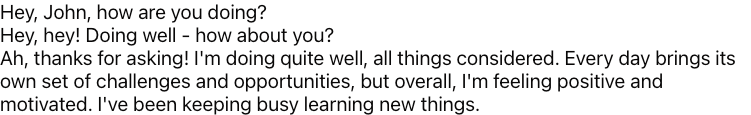
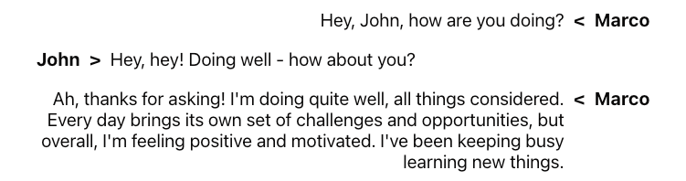
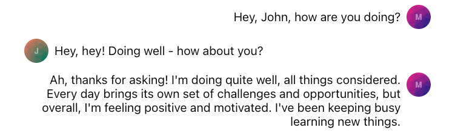
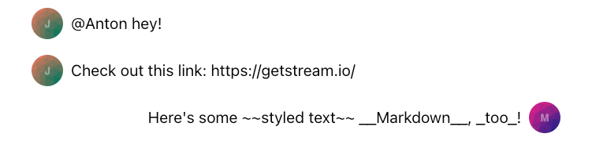
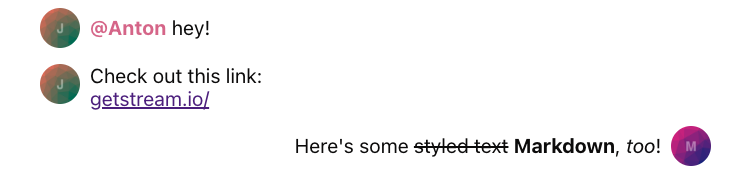
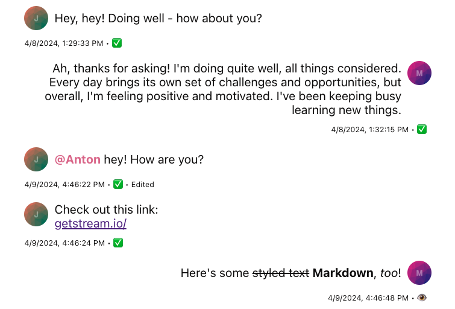
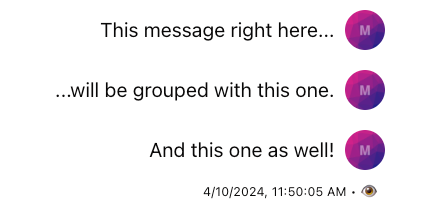
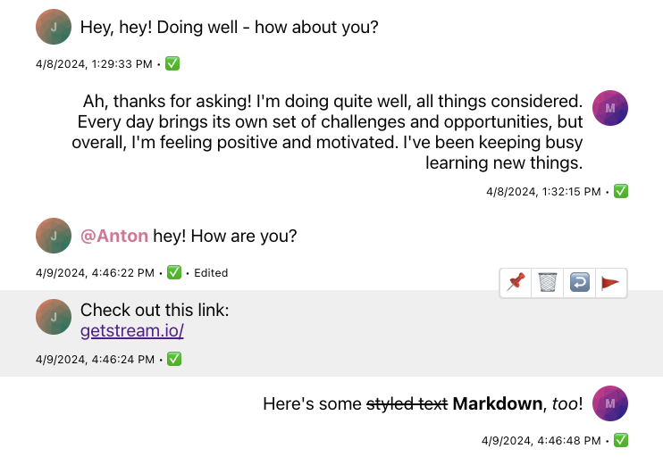
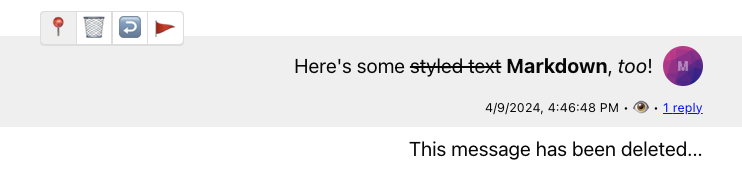
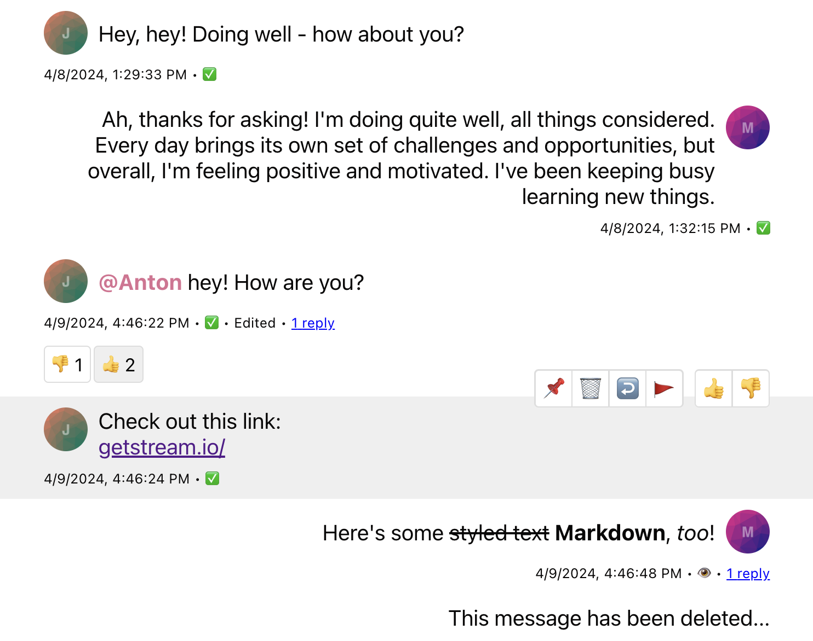

import Tabs from '@theme/Tabs';
import TabItem from '@theme/TabItem';

Message UI is one of the main building blocks of the chat application. Designing proper message UI is no easy feat and that's why our SDK comes with a pre-built component ([`MessageSimple`](https://github.com/GetStream/stream-chat-react/blob/master/src/components/Message/MessageSimple.tsx)) which is packed with functionality and is easy to customize through [our CSS variables](../../theming/component-variables.mdx) or component overrides ([`ComponentContext`](../../components/contexts/component-context.mdx#message)).

In this guide, we'll build a simplified custom message UI component combining pre-built and other completely custom components.

### Message Text and Avatars

Let's begin with the simplest form the message UI can take: rendering the raw message text.

```tsx
import { useMessageContext, Channel } from 'stream-chat-react';

const CustomMessageUi = () => {
  const { message } = useMessageContext();

  return <div data-message-id={message.id}>{message.text}</div>;
};
```

:::note
Message UI and all of its children can access [`MessageContext`](../../components/contexts/message-context.mdx) in which it's wrapped and therefore can call the `useMessageContext` hook accessing all of the message-related information and functions alike.
:::

To see our changes we'll need to pass this component down to either `Channel` or `MessageList` (`VirtualizedMessageList`) components as a `Message` prop.

```tsx
<Channel Message={CustomMessageUi}>...</Channel>
```



You can see that all of the messages are now on one side and we have no idea who's the message coming from, let's adjust that with the help of some CSS, and to render the name of the sender we'll need to access `user` property of the `message` object.

Our message will be on the right and the message of the other senders will be on the left side of the screen.

<Tabs groupId="example">
<TabItem value="js" label="React">

```tsx
import { useMessageContext, Channel } from 'stream-chat-react';

const CustomMessageUi = () => {
  const { isMyMessage, message } = useMessageContext();

  const messageUiClassNames = ['custom-message-ui'];

  if (isMyMessage()) {
    messageUiClassNames.push('custom-message-ui--mine');
  } else {
    messageUiClassNames.push('custom-message-ui--other');
  }

  return (
    <div className={messageUiClassNames.join(' ')} data-message-id={message.id}>
      <strong className='custom-message-ui__name'>{message.user?.name || message.user?.id}</strong>
      <span>{message.text}</span>
    </div>
  );
};
```

</TabItem>

<TabItem value='css' label='CSS'>

```css
.custom-message-ui {
  --cmui-gap-size: 0.5rem;
  --cmui-inline-spacing: 2rem;
  --cmui-block-spacing: 0.5rem;

  display: flex;
  gap: var(--cmui-gap-size);
  padding-inline: var(--cmui-inline-spacing);
  padding-block: var(--cmui-block-spacing);
}

.custom-message-ui__name {
  display: flex;
  gap: var(--cmui-gap-size);
}

.custom-message-ui--mine .custom-message-ui__name::before {
  content: '<';
}

.custom-message-ui--other .custom-message-ui__name::after {
  content: '>';
}

.custom-message-ui--mine {
  flex-direction: row-reverse;
  text-align: right;
}
```

</TabItem>
</Tabs>



Now this already looks way better than the initial version but we can do better - let's switch from names to avatars using a pre-built [`Avatar`](../../components/utility-components/avatar.mdx) component to make the UI slightly friendlier.

<Tabs groupId='example'>
<TabItem value='js' label='React'>

```tsx
import { Avatar, useMessageContext, Channel } from 'stream-chat-react';

const CustomMessageUi = () => {
  const { isMyMessage, message } = useMessageContext();

  const messageUiClassNames = ['custom-message-ui'];

  if (isMyMessage()) {
    messageUiClassNames.push('custom-message-ui--mine');
  } else {
    messageUiClassNames.push('custom-message-ui--other');
  }

  return (
    <div className={messageUiClassNames.join(' ')} data-message-id={message.id}>
      <Avatar image={message.user?.image} name={message.user?.name || message.user?.id} />
      <span className='custom-message-ui__text'>{message.text}</span>
    </div>
  );
};
```

</TabItem>
<TabItem value='css' label='CSS'>

```css
.custom-message-ui {
  --cmui-gap-size: 0.5rem;
  --cmui-inline-spacing: 2rem;
  --cmui-block-spacing: 0.5rem;

  display: flex;
  gap: var(--cmui-gap-size);
  padding-inline: var(--cmui-inline-spacing);
  padding-block: var(--cmui-block-spacing);
}

.custom-message-ui__text {
  display: flex;
  flex-direction: column;
  align-self: center;
}

.custom-message-ui--mine {
  flex-direction: row-reverse;
  text-align: right;
}
```

</TabItem>
</Tabs>



Our message UI looks pretty good now but what if the text of a message becomes more complex? Let's say someone sends a link to a site or mentions some other user. In the current state, our UI would display this in plaintext and none of it would be interactive.



Let's enhance this behavior by using pre-built [`MessageText`](https://github.com/GetStream/stream-chat-react/blob/master/src/components/Message/MessageText.tsx) which uses [`renderText`](../../components/message-components/render-text.mdx) internally and that'll transform all of our links, mention, and certain Markdown syntax to interactive and neat-looking elements.

<Tabs groupId='example'>
<TabItem value='js' label='React'>

```tsx
import { Avatar, MessageText, useMessageContext, Channel } from 'stream-chat-react';

const CustomMessageUi = () => {
  const { isMyMessage, message } = useMessageContext();

  const messageUiClassNames = ['custom-message-ui'];

  if (isMyMessage()) {
    messageUiClassNames.push('custom-message-ui--mine');
  } else {
    messageUiClassNames.push('custom-message-ui--other');
  }

  return (
    <div className={messageUiClassNames.join(' ')} data-message-id={message.id}>
      <Avatar image={message.user?.image} name={message.user?.name || message.user?.id} />
      <MessageText />
    </div>
  );
};
```

</TabItem>
<TabItem value='css' label='css'>

```css
.custom-message-ui {
  --cmui-gap-size: 0.5rem;
  --cmui-inline-spacing: 2rem;
  --cmui-block-spacing: 0.5rem;

  display: flex;
  gap: var(--cmui-gap-size);
  padding-inline: var(--cmui-inline-spacing);
  padding-block: var(--cmui-block-spacing);
}

.custom-message-ui--mine {
  flex-direction: row-reverse;
  text-align: right;
}

.custom-message-ui .str-chat__message-text p {
  all: unset;
}

.custom-message-ui .str-chat__message-text {
  display: flex;
  flex-direction: column;
  align-self: center;
}

.custom-message-ui .str-chat__message-mention {
  font-weight: bold;
  color: palevioletred;
  cursor: pointer;
}
```

</TabItem>
</Tabs>



:::note
While the mentioned user is being highlighted there's no default pointer event attached to the highlighted element, see the [Mentions Actions guide](./actions/mentions-hover-click.mdx) for more information.
:::

### Metadata

So far we've covered avatars and proper text rendering but the UI still feels a bit empty. Each message has a lot of extra information which can be beneficial to the end users. Let's add the creation date, "edited" flag, and delivery/read status information to our message UI.

<Tabs groupId='example'>
<TabItem value='js' label='React'>

```tsx
import { Avatar, MessageText, useMessageContext, useChatContext, Channel } from 'stream-chat-react';

const statusIconMap = {
  received: '✅',
  receivedAndRead: '👁️',
  sending: '🛫',
  unknown: '❓',
};

const CustomMessageUiMetadata = () => {
  const {
    message: {
      created_at: createdAt,
      message_text_updated_at: messageTextUpdatedAt,
      status = 'unknown',
    },
    readBy = [],
  } = useMessageContext();
  const { client } = useChatContext();

  const [firstUser] = readBy;

  const receivedAndRead = readBy.length > 1 || (firstUser && firstUser.id !== client.user?.id);

  return (
    <div className='custom-message-ui__metadata'>
      <div className='custom-message-ui__metadata-created-at'>{createdAt?.toLocaleString()}</div>
      <div className='custom-message-ui__metadata-read-status'>
        {receivedAndRead
          ? statusIconMap.receivedAndRead
          : statusIconMap[status as keyof typeof statusIconMap] ?? statusIconMap.unknown}
      </div>
      {messageTextUpdatedAt && (
        <div className='custom-message-ui__metadata-edited-status' title={messageTextUpdatedAt}>
          Edited
        </div>
      )}
    </div>
  );
};

const CustomMessageUi = () => {
  const { isMyMessage, message } = useMessageContext();

  const messageUiClassNames = ['custom-message-ui'];

  if (isMyMessage()) {
    messageUiClassNames.push('custom-message-ui--mine');
  } else {
    messageUiClassNames.push('custom-message-ui--other');
  }

  return (
    <div className={messageUiClassNames.join(' ')} data-message-id={message.id}>
      <div className='custom-message-ui__body'>
        <Avatar image={message.user?.image} name={message.user?.name || message.user?.id} />
        <MessageText />
      </div>
      <CustomMessageUiMetadata />
    </div>
  );
};
```

</TabItem>
<TabItem value='css' label='css'>

```css
.custom-message-ui {
  --cmui-gap-size-md: 0.5rem;
  --cmui-gap-size-sm: 0.2rem;
  --cmui-inline-spacing: 2rem;
  --cmui-block-spacing: 0.5rem;

  display: flex;
  flex-direction: column;
  gap: var(--cmui-gap-size-md);
  padding-inline: var(--cmui-inline-spacing);
  padding-block: var(--cmui-block-spacing);
}

.custom-message-ui__body {
  gap: var(--cmui-gap-size-md);
  display: flex;
}

.custom-message-ui--mine .custom-message-ui__body {
  flex-direction: row-reverse;
  text-align: right;
}

.custom-message-ui__metadata {
  display: flex;
  font-size: x-small;
  align-items: baseline;
}

.custom-message-ui__metadata > *:nth-child(even)::after,
.custom-message-ui__metadata > *:nth-child(even)::before {
  content: '•';
  padding-inline: var(--cmui-gap-size-sm);
}

.custom-message-ui__metadata > *:last-child::after {
  display: none;
}

.custom-message-ui--mine .custom-message-ui__metadata {
  align-self: flex-end;
}

.custom-message-ui .str-chat__message-text p {
  all: unset;
}

.custom-message-ui .str-chat__message-text {
  display: flex;
  flex-direction: column;
  align-self: center;
}

.custom-message-ui .str-chat__message-mention {
  font-weight: bold;
  color: palevioletred;
  cursor: pointer;
}
```

</TabItem>
</Tabs>



Message grouping is being managed automatically by the SDK and each parent element (which holds our message UI) receives an appropriate class name based on which we can adjust our rules to display metadata elements only when it's appropriate to make our UI look less busy.

{/_ TODO: link to grouping logic (maybe how to adjust it if needed) _/}

```css
.custom-message-ui__metadata {
  /* removed-line */
  display: flex;
  /* added-line */
  display: none;
  font-size: x-small;
  align-items: baseline;
}

/* added-block-start */
.str-chat__li--bottom .custom-message-ui__metadata,
.str-chat__li--single .custom-message-ui__metadata {
  display: flex;
}
/* added-block-end */
```



:::note
You can utilize [`MessageContext`](../../components/contexts/message-context.mdx) properties [`firstOfGroup`](../../components/contexts/message-context.mdx#firstofgroup), [`endOfGroup`](../../components/contexts/message-context.mdx#endofgroup), and [`groupedByUser`](../../components/contexts/message-context.mdx#groupedbyuser) if you use [`VirtualizedMessageList`](../../components/core-components/virtualized-list.mdx) for conditional metadata rendering. These properties **are not available** in regular [`MessageList`](../../components/core-components/message-list.mdx).
:::

The SDK also comes with [`MessageStatus`](https://github.com/GetStream/stream-chat-react/blob/master/src/components/Message/MessageStatus.tsx) and [`MessageTimestamp`](https://github.com/GetStream/stream-chat-react/blob/master/src/components/Message/MessageTimestamp.tsx) components which you can use to replace our custom-made ones. These components come with some extra logic but essentially provide an almost identical amount of utility for the end users so we won't be covering the replacement in this guide.

### Message Actions

Up to this point we've covered mostly the presentational part of our message UI and apart from the mentions and links, there's not much the end users can interact with. Obviously - the SDK offers so much more so in this section of the guide we'll explain how to add and enable message actions (deleting, replies, pinning, etc.) and reactions.

At the very beginning of this guide, we've mentioned that [`MessageContext`](../../components/contexts/message-context.mdx) provides information **and** functions related to a specific message. So to implement a subset of message actions we'll need to access `handleDelete`, `handlePin`, `handleFlag`, and `handleThread` functions which we can attach to the action buttons of our `CustomMessageUiActions` component.

<Tabs groupId='example'>
<TabItem value='js' label='React'>

```tsx
const statusIconMap = {
  received: '✅',
  receivedAndRead: '👁️',
  sending: '🛫',
  unknown: '❓',
};

const CustomMessageUiActions = () => {
  const {
    handleDelete,
    handleFlag,
    handleOpenThread,
    handlePin,
    message,
    threadList,
  } = useMessageContext();

  if (threadList) return null;

  return (
    <div className='custom-message-ui__actions'>
      <div className='custom-message-ui__actions-group'>
        <button onClick={handlePin} title={message.pinned ? 'Unpin' : 'Pin'}>
          {message.pinned ? '📍' : '📌'}
        </button>
        <button onClick={handleDelete} title='Delete'>
          🗑️
        </button>
        <button onClick={handleOpenThread} title='Open thread'>
          ↩️
        </button>
        <button onClick={handleFlag} title='Flag message'>
          🚩
        </button>
      </div>
    </div>
  );
};

const CustomMessageUiMetadata = () => {
  const {
    message: {
      created_at: createdAt,
      message_text_updated_at: messageTextUpdatedAt,
      status = 'unknown',
    },
    readBy = [],
  } = useMessageContext();
  const { client } = useChatContext();

  const [firstUser] = readBy;

  const receivedAndRead = readBy.length > 1 || (firstUser && firstUser.id !== client.user?.id);

  return (
    <div className='custom-message-ui__metadata'>
      <div className='custom-message-ui__metadata-created-at'>{createdAt?.toLocaleString()}</div>
      <div className='custom-message-ui__metadata-read-status'>
        {receivedAndRead
          ? statusIconMap.receivedAndRead
          : statusIconMap[status as keyof typeof statusIconMap] ?? statusIconMap.unknown}
      </div>
      {messageTextUpdatedAt && (
        <div className='custom-message-ui__metadata-edited-status' title={messageTextUpdatedAt}>
          Edited
        </div>
      )}
    </div>
  );
};

const CustomMessageUi = () => {
  const { isMyMessage, message } = useMessageContext();

  const messageUiClassNames = ['custom-message-ui'];

  if (isMyMessage()) {
    messageUiClassNames.push('custom-message-ui--mine');
  } else {
    messageUiClassNames.push('custom-message-ui--other');
  }

  return (
    <div className={messageUiClassNames.join(' ')} data-message-id={message.id}>
      <div className='custom-message-ui__body'>
        <Avatar image={message.user?.image} name={message.user?.name || message.user?.id} />
        <MessageText />
      </div>
      <CustomMessageUiMetadata />
      <CustomMessageUiActions />
    </div>
  );
};
```

</TabItem>
<TabItem value='css' label='CSS'>

```css
.custom-message-ui {
  --cmui-gap-size-md: 0.5rem;
  --cmui-gap-size-sm: 0.2rem;
  --cmui-inline-spacing: 2rem;
  --cmui-block-spacing: 0.5rem;
  --cmui-bg-color: #efefef;
  --cmui-border-color: #ddd;
  --cmui-border-radius: 0.2rem;

  position: relative;
  display: flex;
  flex-direction: column;
  gap: var(--cmui-gap-size-md);
  padding-inline: var(--cmui-inline-spacing);
  padding-block: var(--cmui-block-spacing);
}

.custom-message-ui:hover,
.custom-message-ui:has(.str-chat__message-text:focus) {
  background: var(--cmui-bg-color);
}

.custom-message-ui__body {
  gap: var(--cmui-gap-size-md);
  display: flex;
}

.custom-message-ui--mine .custom-message-ui__body {
  flex-direction: row-reverse;
  text-align: right;
}

.custom-message-ui__actions {
  display: none;
  position: absolute;
  gap: var(--cmui-gap-size-md);
  top: -20px;
}

.custom-message-ui:hover .custom-message-ui__actions {
  display: flex;
}

.custom-message-ui__actions-group {
  display: flex;
  background-color: var(--cmui-border-color);
  border-radius: var(--cmui-border-radius);
  gap: 1px;
  padding: 1px;
}

.custom-message-ui__actions-group button {
  all: unset;
  background: white;
  justify-content: center;
  align-items: center;
  cursor: pointer;
  padding: 5px;
  line-height: 1rem;
}

.custom-message-ui__actions-group button:first-child {
  border-bottom-left-radius: calc(var(--cmui-border-radius) - 1px);
  border-top-left-radius: calc(var(--cmui-border-radius) - 1px);
}

.custom-message-ui__actions-group button:last-child {
  border-bottom-right-radius: calc(var(--cmui-border-radius) - 1px);
  border-top-right-radius: calc(var(--cmui-border-radius) - 1px);
}

.custom-message-ui__actions-group button:hover {
  background: var(--cmui-bg-color);
}

.custom-message-ui__metadata {
  display: none;
  font-size: x-small;
  align-items: baseline;
}

.str-chat__li--bottom .custom-message-ui__metadata,
.str-chat__li--single .custom-message-ui__metadata {
  display: flex;
}

.custom-message-ui__metadata > *:nth-child(even)::after,
.custom-message-ui__metadata > *:nth-child(even)::before {
  content: '•';
  padding-inline: var(--cmui-gap-size-sm);
}

.custom-message-ui__metadata > *:last-child::after {
  display: none;
}

.custom-message-ui--mine .custom-message-ui__metadata {
  align-self: flex-end;
}

.custom-message-ui--mine .custom-message-ui__actions {
  left: var(--cmui-inline-spacing);
}

.custom-message-ui--other .custom-message-ui__actions {
  right: var(--cmui-inline-spacing);
}

.custom-message-ui .str-chat__message-text p {
  all: unset;
}

.custom-message-ui .str-chat__message-text {
  display: flex;
  flex-direction: column;
  align-self: center;
}

.custom-message-ui .str-chat__message-mention {
  font-weight: bold;
  color: palevioletred;
  cursor: pointer;
}
```

</TabItem>
</Tabs>



Now that we've enabled some actions we'll also need to cover certain UI parts that should reflect the latest message state which weren't relevant before. You can see that we've already covered the message's "pinned" state by accessing the `pinned` property of the `message` object and rendering the appropriate icon when this property is set to `true`. See the [Pin Indicator](../customization/pin-indicator.mdx) guide for more customization options. Let's explore other customizations needed for a complete message UI.

:::note
The following code samples contain only the code related to the appropriate components, if you're following along you can copy and add the following examples to whatever you have created up until now. The whole example is [at the bottom](./message-ui.mdx#complete-example) of this guide.
:::

#### Thread and Reply Count

First - upon opening a thread and replying to a message, the message's property `reply_count` changes; let's add the count indicator button beside the rest of the metadata elements so the end users can access the thread from two places.

<Tabs groupId='example'>
<TabItem value='js' label='React'>

```tsx
const CustomMessageUiMetadata = () => {
  const {
    message: {
      created_at: createdAt,
      message_text_updated_at: messageTextUpdatedAt,
      // added-line
      reply_count: replyCount = 0,
      status = 'unknown',
    },
    readBy = [],
    handleOpenThread,
  } = useMessageContext();
  const { client } = useChatContext();

  const [firstUser] = readBy;

  const receivedAndRead = readBy.length > 1 || (firstUser && firstUser.id !== client.user?.id);

  return (
    <div className='custom-message-ui__metadata'>
      <div className='custom-message-ui__metadata-created-at'>{createdAt?.toLocaleString()}</div>
      <div className='custom-message-ui__metadata-read-status'>
        {receivedAndRead
          ? statusIconMap.receivedAndRead
          : statusIconMap[status as keyof typeof statusIconMap] ?? statusIconMap.unknown}
      </div>
      {messageTextUpdatedAt && (
        <div className='custom-message-ui__metadata-edited-status' title={messageTextUpdatedAt}>
          Edited
        </div>
      )}
      // added-block-start
      {replyCount > 0 && (
        <button className='custom-message-ui__metadata-reply-count' onClick={handleOpenThread}>
          <span>
            {replyCount} {replyCount > 1 ? 'replies' : 'reply'}
          </span>
        </button>
      )}
      // added-block-end
    </div>
  );
};
```

</TabItem>
<TabItem value='css' label='CSS'>

```css
.custom-message-ui__metadata-reply-count {
  all: unset;
}

.custom-message-ui__metadata-reply-count > span {
  color: blue;
  text-decoration: underline;
  cursor: pointer;
}
```

</TabItem>
</Tabs>

#### Deleted Message

Since now we're also able to soft delete our own messages we'll need to render a slightly different UI to handle such a case. Let's add a condition where we check whether the `deleted_at` property of the `message` object exists and if it does we'll simply fall back to "message deleted" text.

```tsx
const CustomMessageUi = () => {
  const { isMyMessage, message } = useMessageContext();

  const messageUiClassNames = ['custom-message-ui'];

  if (isMyMessage()) {
    messageUiClassNames.push('custom-message-ui--mine');
  } else {
    messageUiClassNames.push('custom-message-ui--other');
  }

  return (
    <div className={messageUiClassNames.join(' ')} data-message-id={message.id}>
      // added-block-start
      {message.deleted_at && (
        <div className='custom-message-ui__body'>This message has been deleted...</div>
      )}
      {!message.deleted_at && (
        <>
          <div className='custom-message-ui__body'>
            <Avatar image={message.user?.image} name={message.user?.name || message.user?.id} />
            <MessageText />
          </div>
          <CustomMessageUiMetadata />
          <CustomMessageUiActions />
        </>
      )}
      // added-block-end
    </div>
  );
};
```



### Reactions

With message actions in place we've made our message UI slightly more interactive but there's still a place for improvement. In this section of the guide we'll create a simple selector consisting of two reactions (thumbs up and down) and to display them we'll reuse and slightly modify the [`ReactionsList`](../../components/message-components/reactions.mdx#reactionslist-props) component provided by the SDK. Let's begin by defining `customReactionOptions` (see more in the [Reactions Customization](./reactions.mdx) guide) and by passing them down to a `reactionOptions` prop of a [`Channel`](../../components/core-components/channel.mdx) component.

```tsx
const customReactionOptions = [
  { name: 'Thumbs up', type: '+1', Component: () => <>👍</> },
  { name: 'Thumbs down', type: '-1', Component: () => <>👎</> },
];

<Channel Message={CustomMessageUi} reactionOptions={customReactionOptions}>
  ...
</Channel>;
```

And now that's done we can continue by extending our `CustomMessageUiActions` component using these newly defined options.

```tsx
const CustomMessageUiActions = () => {
  const {
    handleDelete,
    handleFlag,
    handleOpenThread,
    handlePin,
    // added-line
    handleReaction,
    message,
    threadList,
  } = useMessageContext();

  // added-line
  const { reactionOptions } = useComponentContext();

  if (threadList) return null;

  return (
    <div className='custom-message-ui__actions'>
      <div className='custom-message-ui__actions-group'>
        <button onClick={handlePin} title={message.pinned ? 'Unpin' : 'Pin'}>
          {message.pinned ? '📍' : '📌'}
        </button>
        <button onClick={handleDelete} title='Delete'>
          🗑️
        </button>
        <button onClick={handleOpenThread} title='Open thread'>
          ↩️
        </button>
        <button onClick={handleFlag} title='Flag message'>
          🚩
        </button>
      </div>
      // added-block-start
      <div className='custom-message-ui__actions-group'>
        {reactionOptions.map(({ Component, name, type }) => (
          <button key={type} onClick={(e) => handleReaction(type, e)} title={`React with: ${name}`}>
            <Component />
          </button>
        ))}
      </div>
      // added-block-end
    </div>
  );
};
```

Finally, we can add the `ReactionsList` component to our `CustomMessageUi` component and adjust the styles accordingly.

#### Complete Example

<Tabs groupId='example'>
<TabItem value='js' label='React'>

```tsx
import {
  Avatar,
  MessageText,
  ReactionsList,
  useMessageContext,
  useChatContext,
  Channel,
} from 'stream-chat-react';

const customReactionOptions = [
  { name: 'Thumbs up', type: '+1', Component: () => <>👍</> },
  { name: 'Thumbs down', type: '-1', Component: () => <>👎</> },
];

const statusIconMap = {
  received: '✅',
  receivedAndRead: '👁️',
  sending: '🛫',
  unknown: '❓',
};

const CustomMessageUiActions = () => {
  const {
    handleDelete,
    handleFlag,
    handleOpenThread,
    handlePin,
    handleReaction,
    message,
    threadList,
  } = useMessageContext();

  const { reactionOptions } = useComponentContext();

  if (threadList) return null;

  return (
    <div className='custom-message-ui__actions'>
      <div className='custom-message-ui__actions-group'>
        <button onClick={handlePin} title={message.pinned ? 'Unpin' : 'Pin'}>
          {message.pinned ? '📍' : '📌'}
        </button>
        <button onClick={handleDelete} title='Delete'>
          🗑️
        </button>
        <button onClick={handleOpenThread} title='Open thread'>
          ↩️
        </button>
        <button onClick={handleFlag} title='Flag message'>
          🚩
        </button>
      </div>
      <div className='custom-message-ui__actions-group'>
        {reactionOptions.map(({ Component, name, type }) => (
          <button key={type} onClick={(e) => handleReaction(type, e)} title={`React with: ${name}`}>
            <Component />
          </button>
        ))}
      </div>
    </div>
  );
};

const CustomMessageUiMetadata = () => {
  const {
    message: {
      created_at: createdAt,
      message_text_updated_at: messageTextUpdatedAt,
      reply_count: replyCount = 0,
      status = 'unknown',
    },
    readBy = [],
    handleOpenThread,
  } = useMessageContext();
  const { client } = useChatContext();

  const [firstUser] = readBy;

  const receivedAndRead = readBy.length > 1 || (firstUser && firstUser.id !== client.user?.id);

  return (
    <div className='custom-message-ui__metadata'>
      <div className='custom-message-ui__metadata-created-at'>{createdAt?.toLocaleString()}</div>
      <div className='custom-message-ui__metadata-read-status'>
        {receivedAndRead
          ? statusIconMap.receivedAndRead
          : statusIconMap[status as keyof typeof statusIconMap] ?? statusIconMap.unknown}
      </div>
      {messageTextUpdatedAt && (
        <div className='custom-message-ui__metadata-edited-status' title={messageTextUpdatedAt}>
          Edited
        </div>
      )}
      {replyCount > 0 && (
        <button className='custom-message-ui__metadata-reply-count' onClick={handleOpenThread}>
          <span>
            {replyCount} {replyCount > 1 ? 'replies' : 'reply'}
          </span>
        </button>
      )}
    </div>
  );
};

const CustomMessageUi = () => {
  const { isMyMessage, message } = useMessageContext();

  const messageUiClassNames = ['custom-message-ui'];

  if (isMyMessage()) {
    messageUiClassNames.push('custom-message-ui--mine');
  } else {
    messageUiClassNames.push('custom-message-ui--other');
  }

  return (
    <div className={messageUiClassNames.join(' ')} data-message-id={message.id}>
      {message.deleted_at && (
        <div className='custom-message-ui__body'>This message has been deleted...</div>
      )}
      {!message.deleted_at && (
        <>
          <div className='custom-message-ui__body'>
            <Avatar image={message.user?.image} name={message.user?.name || message.user?.id} />
            <MessageText />
          </div>
          <CustomMessageUiMetadata />
          <CustomMessageUiActions />
          // added-line
          <ReactionsList />
        </>
      )}
    </div>
  );
};
```

</TabItem>
<TabItem value='css' label='CSS'>

```css
.custom-message-ui {
  --cmui-gap-size-md: 0.5rem;
  --cmui-gap-size-sm: 0.2rem;
  --cmui-inline-spacing: 2rem;
  --cmui-block-spacing: 0.5rem;
  --cmui-bg-color: #efefef;
  --cmui-border-color: #ddd;
  --cmui-border-radius: 0.2rem;
  --str-chat__own-message-reaction-background-color: var(--cmui-bg-color);
  --str-chat__message-reaction-background-color: white;
  --str-chat__message-reaction-border-radius: var(--cmui-border-radius);

  position: relative;
  display: flex;
  flex-direction: column;
  gap: var(--cmui-gap-size-md);
  padding-inline: var(--cmui-inline-spacing);
  padding-block: var(--cmui-block-spacing);
}

.custom-message-ui:hover,
.custom-message-ui:has(.str-chat__message-text:focus) {
  background: var(--cmui-bg-color);
}

.custom-message-ui__body {
  gap: var(--cmui-gap-size-md);
  display: flex;
}

.custom-message-ui--mine .custom-message-ui__body {
  flex-direction: row-reverse;
  text-align: right;
}

.custom-message-ui__actions {
  display: none;
  position: absolute;
  gap: var(--cmui-gap-size-md);
  top: -20px;
}

.custom-message-ui:hover .custom-message-ui__actions {
  display: flex;
}

.custom-message-ui__actions-group {
  display: flex;
  background-color: var(--cmui-border-color);
  border-radius: var(--cmui-border-radius);
  gap: 1px;
  padding: 1px;
}

.custom-message-ui__actions-group button {
  all: unset;
  background: white;
  justify-content: center;
  align-items: center;
  cursor: pointer;
  padding: 5px;
  line-height: 1rem;
}

.custom-message-ui__actions-group button:first-child {
  border-bottom-left-radius: calc(var(--cmui-border-radius) - 1px);
  border-top-left-radius: calc(var(--cmui-border-radius) - 1px);
}

.custom-message-ui__actions-group button:last-child {
  border-bottom-right-radius: calc(var(--cmui-border-radius) - 1px);
  border-top-right-radius: calc(var(--cmui-border-radius) - 1px);
}

.custom-message-ui__actions-group button:hover {
  background: var(--cmui-bg-color);
}

.custom-message-ui__metadata {
  display: none;
  font-size: x-small;
  align-items: baseline;
}

.str-chat__li--bottom .custom-message-ui__metadata,
.str-chat__li--single .custom-message-ui__metadata {
  display: flex;
}

.custom-message-ui__metadata > *:nth-child(even)::after,
.custom-message-ui__metadata > *:nth-child(even)::before {
  content: '•';
  padding-inline: var(--cmui-gap-size-sm);
}

.custom-message-ui__metadata > *:last-child::after {
  display: none;
}

.custom-message-ui__metadata-reply-count {
  all: unset;
}

.custom-message-ui__metadata-reply-count > span {
  color: blue;
  text-decoration: underline;
  cursor: pointer;
}

.custom-message-ui--mine .str-chat__reaction-list {
  align-self: flex-end;
}

.custom-message-ui--mine .custom-message-ui__metadata {
  align-self: flex-end;
}

.custom-message-ui--mine .custom-message-ui__actions {
  left: var(--cmui-inline-spacing);
}

.custom-message-ui--other .custom-message-ui__actions {
  right: var(--cmui-inline-spacing);
}

.custom-message-ui .str-chat__message-text p {
  all: unset;
}

.custom-message-ui .str-chat__message-text {
  display: flex;
  flex-direction: column;
  align-self: center;
}

.custom-message-ui .str-chat__message-mention {
  font-weight: bold;
  color: palevioletred;
  cursor: pointer;
}

.custom-message-ui .str-chat__message-reaction {
  border: 1px solid var(--cmui-border-color);
  padding: 5px;
}
```

</TabItem>
</Tabs>



### Attachments

The topic of attachments is pretty substantial by itself, so we won't be covering it in this guide. Please, refer to the source code of our default [`MessageSimple`](https://github.com/GetStream/stream-chat-react/blob/fdd021880d783af39e46e1327f2eb47c19199f09/src/components/Message/MessageSimple.tsx#L196-L198) for details on implementation and see the [Custom Attachment](../../guides/theming/actions/attachment-actions.mdx#custom-attachment) guide for more customization options.

### Read More

Functionalities relevant to the Message UI that are also not covered in this guide:

- [Edit Message](https://github.com/GetStream/stream-chat-react/blob/fdd021880d783af39e46e1327f2eb47c19199f09/src/components/Message/MessageSimple.tsx#L150-L161) functionality
- [Message Bounced](https://github.com/GetStream/stream-chat-react/blob/fdd021880d783af39e46e1327f2eb47c19199f09/src/components/Message/MessageSimple.tsx#L162-L168) functionality
- [Permissions](../../components/contexts/channel-state-context.mdx#channelcapabilities) of the message actions
