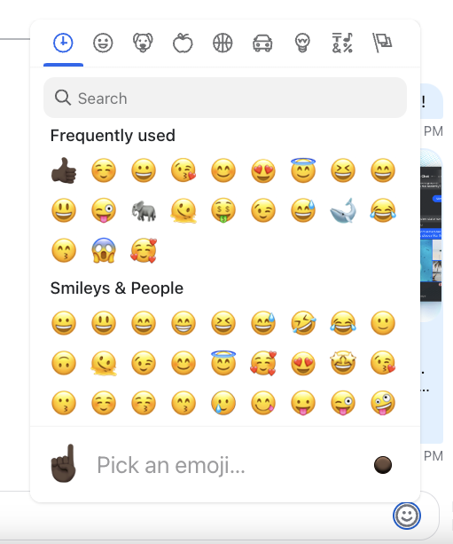

The SDK comes with the `EmojiPicker` component which is built on top of the [`emoji-mart`](https://github.com/missive/emoji-mart) and is disabled by default but can be easily enabled by installing [`emoji-mart` related packages](https://github.com/GetStream/stream-chat-react/blob/master/package.json#L100-L102), importing the component from `stream-chat-react/emojis` and forwarding it to the [`Channel`](../core-components/channel.mdx) component, see the [_Basic Usage_ section](../../guides/customization/emoji-picker.mdx#basic-usage) of the customization guide for more information.

## Props

### ButtonIconComponent

The icon component to be rendered within open/close button.

| Type                | Default                                                                                                                       |
| ------------------- | ----------------------------------------------------------------------------------------------------------------------------- |
| React.ComponentType | [`EmojiPickerIcon`](https://github.com/GetStream/stream-chat-react/blob/master/src/components/MessageInput/icons.tsx#L38-L49) |

### buttonClassName

The `className` to be used in the open/close button instead of the default one.

| Type   | Default                           |
| ------ | --------------------------------- |
| string | 'str-chat\_\_emoji-picker-button' |

### pickerContainerClassName

The `className` to be used in the picker container element instead of the default one.

| Type   | Default                                               |
| ------ | ----------------------------------------------------- |
| string | 'str-chat\_\_message-textarea-emoji-picker-container' |

### wrapperClassName

The `className` to be used in the wrapper element of the whole component instead of the default one.

| Type   | Default                                     |
| ------ | ------------------------------------------- |
| string | 'str-chat\_\_message-textarea-emoji-picker' |

### closeOnEmojiSelect

The flag which specifies whether the emoji picker component should close after an emoji has been selected.

| Type    | Default |
| ------- | ------- |
| boolean | false   |

### pickerProps

Untyped [properties](https://github.com/missive/emoji-mart/tree/v5.5.2#options--props) to be passed down to the [emoji-mart `Picker`](https://github.com/missive/emoji-mart/tree/v5.5.2#-picker) component.

| Type                                                                        |
| --------------------------------------------------------------------------- |
| Partial<{ theme: 'auto' \| 'light' \| 'dark' } & Record<string, unknown\>\> |

### popperOptions

[React Popper options](https://popper.js.org/docs/v2/constructors/#options) to be passed down to the [react-popper `usePopper`](https://popper.js.org/react-popper/v2/hook/) hook.

| Type              |
| ----------------- |
| Partial<Options\> |
