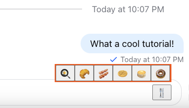

In this guide we'll show you how to add `EmojiPicker` component to your chat application as no chat experience is complete without emojis.

## Prerequisities

Our `EmojiPicker` is built on top of `emoji-mart` so let's begin with installing `emoji-mart`-related packages (make sure they meet our [peer-dependency requirements](https://github.com/GetStream/stream-chat-react/blob/v11.0.0/package.json#L97-L99)):

```bash
yarn add emoji-mart @emoji-mart/data @emoji-mart/react
```

## Basic Usage

The SDK `EmojiPicker` carries both button and the actual picker components and owns its "open" state.

```tsx
import { Channel } from 'stream-chat-react';
import { EmojiPicker } from 'stream-chat-react/emojis';

const WrappedChannel = ({ children }) => {
  return <Channel EmojiPicker={EmojiPicker}>{children}</Channel>;
};
```


## Building custom EmojiPicker component

If `emoji-mart` is too heavy for your use-case and you'd like to build your own you can certainly do so, here's a very simple `EmojiPicker` example built using native emojis:

```tsx
import { useMessageInputContext } from 'stream-chat-react';

const emojis = ['🍳', '🥐', '🥓', '🧇', '🥞', '🍩'];

export const CustomEmojiPicker = () => {
  const [open, setOpen] = useState(false);

  const { insertText, textareaRef } = useMessageInputContext('CustomEmojiPicker');

  return (
    <div
      id='emoji-picker'
      style={{ display: 'flex', alignItems: 'flex-end', justifyContent: 'flex-end' }}
    >
      {open && (
        <div
          style={{ position: 'absolute', top: '-20px', background: 'orangered', padding: '2px' }}
        >
          {emojis.map((emoji) => (
            <button
              key={emoji}
              onClick={() => {
                insertText(emoji);
                textareaRef.current?.focus(); // returns focus back to the message input element
              }}
            >
              {emoji}
            </button>
          ))}
        </div>
      )}

      <button onClick={() => setOpen((isOpen) => !isOpen)}>🍴</button>
    </div>
  );
};
```


