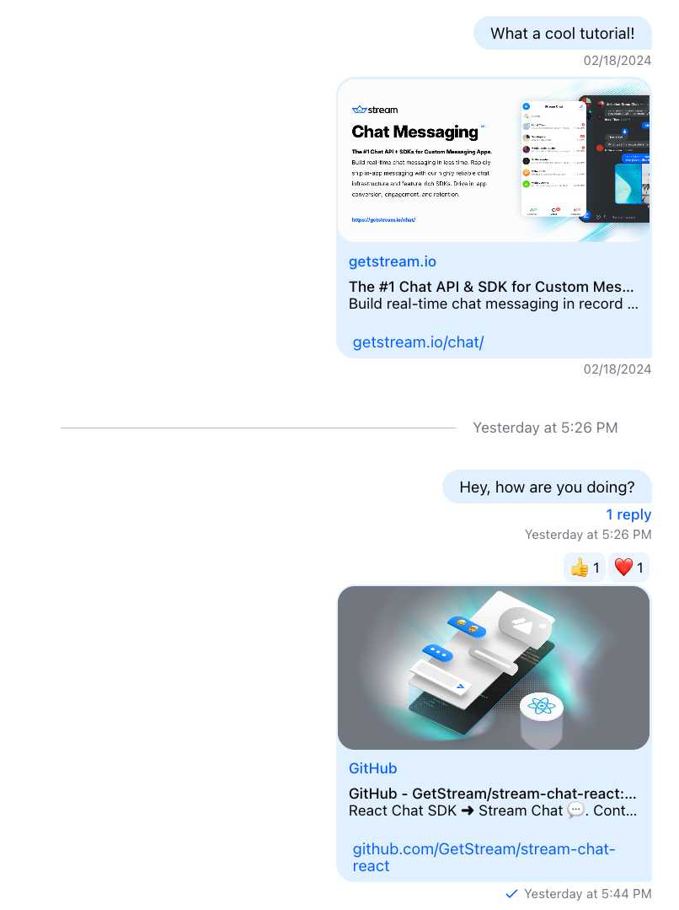
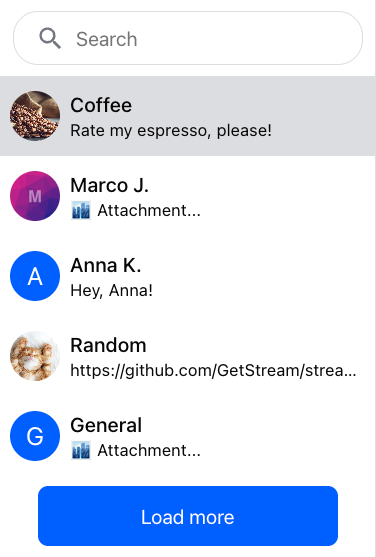
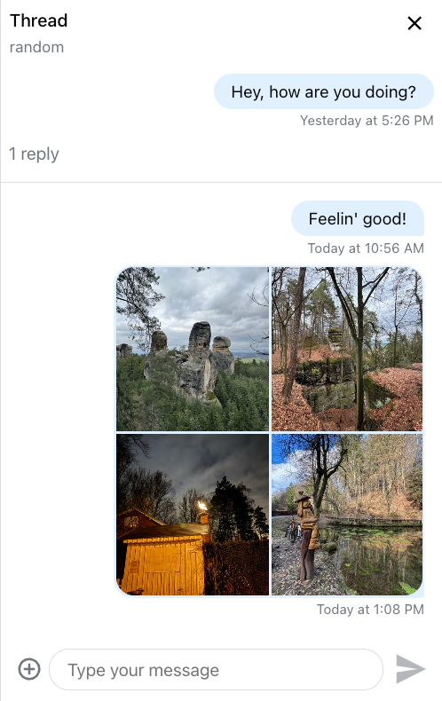

When [Theming](../../theming/introduction.mdx) is not enough for how you want our chat SDK to look and behave, customization is the next step. By customizing specific components you can make precise adjustments to the look and feel of our SDK exactly where you need them.

## Showcase of the Default UI Components

### MessageList

### ChannelList

### MessageInput

### ChannelHeader

### Thread

