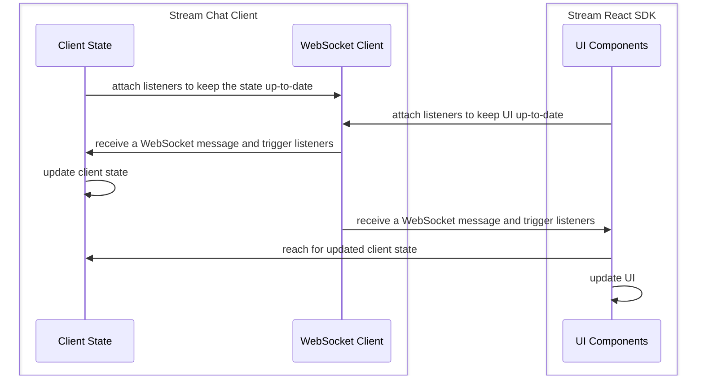

Most of the application state which is the main driver behind the UI changes of our chat SDK lives within our low-level client (LLC) - [`StreamChat`](https://github.com/GetStream/stream-chat-js) - more specifically client and channel instances and is **NOT REACTIVE** - our React SDK makes these state stores reactive by listening to the same events client does and copies it with the help of `useState` API after it has been changed. Optimistic updates - if applicable - are handled by and are local only to React SDK.

This is how the SDK state pipeline looks like behind the scenes:



## Active Channel & Channel State

The SDK comes with [`ChatContext`](../components/contexts/chat-context.mdx) which holds (among other things) currently active channel instance and forwards LLC instance passed to the [`Chat`](../components/core-components/chat.mdx) component.
Before you can access the _reactive_ channel state you'll need to set the channel instance as active. The channel becomes active when:

- it's user-selected in the [`ChannelList`](../components/core-components/channel-list.mdx) component (if you're using our ([default setup](../basics/getting-started.mdx#your-first-app-with-stream-chat-react)), you probably already have `ChannelList` in your application)
- it's passed to the `channel` prop of the [`Channel`](../components/core-components/channel.mdx) component

  ```tsx
  import { useState, useEffect } from 'react';
  import { Channel, useChatContext } from 'stream-chat-react';

  export const ChannelWrapper = ({ channelId, channelType = 'messaging', children }) => {
    const [activeChannel, setActiveChannel] = useState(undefined);
    const { client } = useChatContext();

    useEffect(() => {
      if (!channelId) return;

      const channel = client.channel(channelId, channelType);

      setActiveChannel(channel);
    }, [channelId, channelType]);

    return <Channel channel={activeChannel}>{children}</Channel>;
  };
  ```

- it's set as active by calling the [`setActiveChannel`](../components/contexts/chat-context.mdx#setactivechannel) function coming from the [`ChatContext`](../components/contexts/chat-context.mdx) (this function is used by [`ChannelList`](../components/core-components/channel-list.mdx) behind the scenes)

  ```tsx
  import { useEffect } from 'react';
  import { useCreateChatClient, useChatContext, Chat, Channel } from 'stream-chat-react';

  const ActiveChannelSetter = ({ channelId, channelType }) => {
    const { client, setActiveChannel } = useChatContext();

    useEffect(() => {
      const channel = client.channel(channelId, channelType);
      setActiveChannel(channel);
    }, [channelType, channelId]);

    return null;
  };

  const App = () => {
    const client = useCreateChatClient(userData);

    if (!client) return <div>Loading...</div>;

    return (
      <Chat client={client}>
        <ActiveChannelSetter channelId='random' channelType='messaging' />
        <Channel>{'...other components...'}</Channel>
      </Chat>
    );
  };
  ```

:::note
You can use either `channel` prop on the [`Channel`](../components/core-components/channel.mdx) component or [`setActiveChannel`](../components/contexts/chat-context.mdx#setactivechannel) function. You cannot use both at the same time.
:::

Currently active [channel state](https://github.com/GetStream/stream-chat-react/blob/master/src/context/ChannelStateContext.tsx#L36-L56) and channel instance can be accessed through the [`ChannelStateContext`](../components/contexts/channel-state-context.mdx) with the help of the [`useChannelStateContext`](../components/contexts/channel-state-context.mdx#basic-usage) hook - meaning any component which is either direct or indirect child of the [`Channel`](../components/core-components/channel.mdx) component can access such state.

The example bellow shows how to reach `members` and `channel` property coming from the channel state:

```tsx
import { useEffect } from 'react';
import { Channel, useChannelStateContext } from 'stream-chat-react';

const MembersCount = () => {
  const { members, channel } = useChannelStateContext();

  useEffect(() => {
    console.log(`Currently active channel changed, channelId: ${channel.id}`);
  }, [channel]);

  return <div>{Object.keys(members).length}</div>;
};

const ChannelWrapper = () => (
  <Channel>
    <MembersCount />
  </Channel>
);
```

## Channel List State

[`ChannelList`](../components/core-components/channel-list.mdx) component is a standalone component which (unsurprisingly) holds and manages list of channels. You can access loaded `channels` from [`ChannelListContext`](../components/contexts/channel-list-context.mdx) with the help of `useChannelListContext` hook. Any component which is either direct or indirect child of the [`ChannelList`](../components/core-components/channel-list.mdx) component can access such state ([Channel Preview](../components/utility-components/channel-preview-ui.mdx) for example).

```tsx
import { ChannelList, ChannelPreviewMessenger } from 'stream-chat-react';
import type { ChannelListProps } from 'stream-chat-react';

const CustomPreviewUI = (props) => {
  const { channels } = useChannelListContext();

  return <ChannelPreviewMessenger {...props} />;
};

export const CustomChannelList = (props: ChannelListProps) => {
  return <ChannelList Preview={CustomPreviewUI} {...props} />;
};
```

## Conclusion

This guide covers the biggest and most important state stores, see other React stateful contexts exported by our SDK for more information.

Mentioned in this article:

- [`ChannelStateContext`](../components/contexts/channel-state-context.mdx)
- [`ChatContext`](../components/contexts/chat-context.mdx)
- [`ChannelListContext`](../components/contexts/channel-list-context.mdx)

Other data/action providers:

- [`ComponentContext`](../components/contexts/component-context.mdx)
- [`ChannelActionContext`](../components/contexts/channel-action-context.mdx)
- [`MessageContext`](../components/contexts/message-context.mdx)
- [`MessageInputContext`](../components/contexts/message-input-context.mdx)
- [`MessageListContext`](../components/contexts/message-list-context.mdx)
