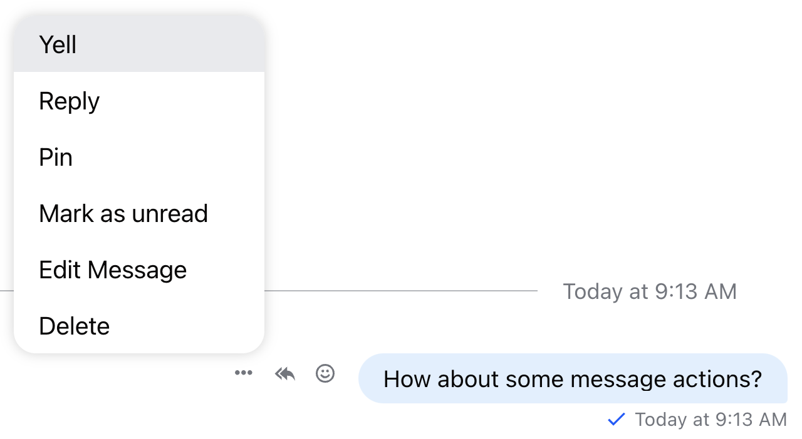

In this example, we will demonstrate how to add a custom message action. By default, the component library supports the following message actions:

- `delete`
- `edit`
- `flag`
- `mute`
- `pin`
- `quote`
- `react`
- `reply`

## Using customMessageActions

The `MessageList` component accepts a prop called [`customMessageActions`](../../../components/core-components/message-list.mdx#custommessageactions). This prop is an object type, with the key serving as the name (and the title) of the action and the value as the handler function to be run on click.

In the examples below, we'll add a custom option `Yell`, which will call a window alert on click.

:::note
The custom action handler receives both the `message` object and on click `event` as function arguments.
:::

```tsx
import { MessageList } from 'stream-chat-react';
import type { CustomMessageActions } from 'stream-chat-react';

const customMessageActions: CustomMessageActions = {
  Yell: (message, event) => {
    window.alert(`Yell action clicked on message: ${message.id}!`);
  },
};

export const WrappedMessageList = () => {
  return <MessageList customMessageActions={customMessageActions} />;
};
```

## Using CustomMessageActionList Component

If you need more flexibility - for example; adding translations to your action titles - you can utilise `CustomMessageActionList` component instead.

:::note
Unless you replicate the internal functionality of the default [`CustomMessageActionList`](https://github.com/GetStream/stream-chat-react/blob/master/src/components/MessageActions/CustomMessageActionsList.tsx) you'll be only able to use one of the customization options mentioned in this guide.
:::

```tsx
import { Channel } from 'stream-chat-react';

const CustomMessageActionList = () => {
  const { message } = useMessageContext('CustomMessageActionList');
  const { t } = useTranslationContext('CustomMessageActionList');

  return (
    <>
      <button
        className='str-chat__message-actions-list-item str-chat__message-actions-list-item-button'
        onClick={(event) => {
          window.alert(`Yell action clicked on message: ${message.id}!`);
        }}
      >
        {t('yell')}
      </button>

      {/** ...other action buttons... */}
    </>
  );
};

export const WrappedChannel = ({ children }) => (
  <Channel CustomMessageActionList={CustomMessageActionList}>{children}</Channel>
);
```

The custom actions will be displayed on top of the defaults in the message actions list.


